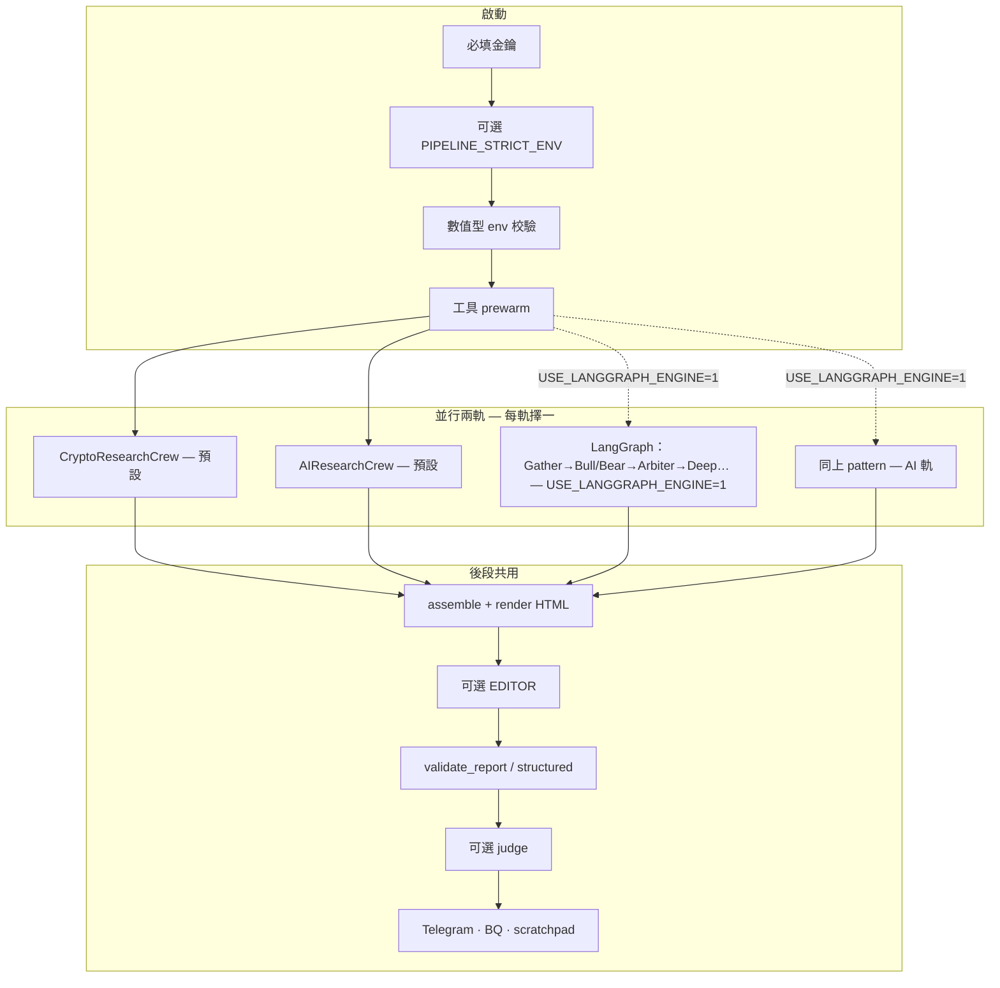

# Q-Silicon Institutional Research AI Agent

**機構風格日報管線**：以 **Python** 串起 **CrewAI**、**LiteLLM** 與可選 **LangGraph**，並行產出 **加密** 與 **AI／美股基本面** 研究 → **Pydantic 契約** 與 **HTML Gate** → 可選潤稿／LLM 評分 → **Telegram HTML**；指標與日誌可寫 **BigQuery**；**Streamlit** 與 **React PWA** 呈現戰情室。

| 快速連結 | |
|----------|---|
| 待辦與路線 | [`TODOS.md`](TODOS.md) · [`docs/REPO_CONTINUATION_EXECUTION.md`](docs/REPO_CONTINUATION_EXECUTION.md) |
| 變更紀錄 | [`CHANGELOG.md`](CHANGELOG.md) |
| 開發者導覽 | [`CLAUDE.md`](CLAUDE.md) · [`AGENTS.md`](AGENTS.md) |
| 環境變數全文 | [`ENV_TEMPLATE.txt`](ENV_TEMPLATE.txt)（複製為 `.env`） |
| 日報版面規格 | [`docs/DAILY_BRIEF_V2.md`](docs/DAILY_BRIEF_V2.md) |

---

## 設計紅線（必讀）

- **無數據幻覺**：報價、技術指標、宏觀數字等客觀數據須由 **Python 工具／API** 取得並注入 Context；LLM **不得**自行推算或捏造。
- **X／Twitter**：日報主線 **不依賴** X 搜尋（見 [`.cursorrules`](.cursorrules)）。
- **Telegram HTML**：僅允許 `<b>` `<i>` `<u>` `<s>` `<code>` `<blockquote>` `<a>`；區塊順序：儀表板 → 核心新聞 → 市場呢喃 → 精準操作（詳見 `DAILY_BRIEF_V2`）。

---

## 目次

1. [你現在要做什麼？](#你現在要做什麼)  
2. [快速開始](#快速開始)  
3. [架構：雙軌研究引擎](#架構雙軌研究引擎)  
4. [核心模組](#核心模組)  
5. [Agent 與模型](#agent-與模型)  
6. [環境變數](#環境變數)  
7. [驗證、Gate 與觀測](#驗證gate-與觀測)  
8. [開發與測試](#開發與測試)  
9. [目錄結構](#目錄結構)  
10. [Docker](#docker)  
11. [CI／GitHub Actions](#cigithub-actions)  
12. [資料流](#資料流)  
13. [輔助腳本](#輔助腳本)  
14. [文件索引](#文件索引)  
15. [CoinGlass API v4](#coinglass-api-v4)  
16. [安全與維運](#安全與維運)  
17. [War Room PWA 與 API](#war-room-pwa-與-api)  
18. [gstack（選用）](#gstack選用)  

---

## 你現在要做什麼？

| 目標 | 建議第一步 | 需要 API 金鑰？ |
|------|------------|-----------------|
| 只看戰情室 UI | `streamlit run dashboard.py --server.port 8501 --server.headless true` | **否**（BQ 區塊會降級） |
| 看 PWA 版型 | [`War Room PWA`](#war-room-pwa-與-api)：`VITE_GLASSBOX_MOCK=1 npm run dev` | **否**（示範資料） |
| 對齊 CI | `ruff check .` 與 `pytest -m smoke` | **否** |
| 本機乾跑管線（不推播、不寫 BQ） | `SKIP_TELEGRAM=1 SKIP_BIGQUERY=1 python main.py` | **是**（啟動必填四項，見下） |
| 正式產報＋推播＋雲端 | 備齊 Telegram、GCP、資料源；建議 `PIPELINE_STRICT_ENV=1` | **是** |

**約 30–60 分鐘上手路徑**

1. 讀 [設計紅線](#設計紅線必讀) 與 [`docs/DAILY_BRIEF_V2.md`](docs/DAILY_BRIEF_V2.md) 前兩節。  
2. 啟動 Streamlit，對照 [`docs/DASHBOARD_CONTRACT.md`](docs/DASHBOARD_CONTRACT.md)。  
3. `cp ENV_TEMPLATE.txt .env`，至少填 **啟動必填**。  
4. `python3 -m pytest -m smoke -q`。  
5. 第一次跑 `main.py` 建議加 `SKIP_TELEGRAM=1 SKIP_BIGQUERY=1`。

**常見問題**

- **一跑就缺 key**：啟動檢查 `XAI_API_KEY`、`OPENAI_API_KEY`、`GEMINI_API_KEY`、`APIFY_API_TOKEN`（與 `SKIP_*` 無關）。  
- **跑 15–30+ 分鐘**：雙軌研究、多 Agent、工具與 Gate 重試屬正常；`LOG_LEVEL=DEBUG` 可看階段。  
- **Gate 擋下**：看終端 `issues`；`GATE_FAILURE_ARTIFACTS=1` 寫入 `.qsilicon/last_gate_failure/`。  
- **CoinGlass 401**：多為方案不含該端點，見 [CoinGlass](#coinglass-api-v4)。  
- **選幣／選股重複感**：見 [`docs/PICK_ROTATION_SEMANTICS.md`](docs/PICK_ROTATION_SEMANTICS.md) 與 `ENV_TEMPLATE` 內 `PICK_ROLLING_*`、`STRICT_PICK_*`。

---

## 快速開始

```bash
pip install -r requirements.txt
cp ENV_TEMPLATE.txt .env   # 編輯填入金鑰
python main.py
```

| 情境 | 指令 |
|------|------|
| 乾跑 | `SKIP_TELEGRAM=1 SKIP_BIGQUERY=1 python main.py` |
| 生產式啟動檢查 | `PIPELINE_STRICT_ENV=1`（未 skip 時強制 Telegram／GCP 齊備） |
| 除錯 | `LOG_LEVEL=DEBUG CREW_VERBOSE=1 python main.py` |
| 雙軌比對（觀測用） | `REPORT_COMPARE_MODE=1 python main.py` → [`docs/REPORT_COMPARE_STAGING.md`](docs/REPORT_COMPARE_STAGING.md) |
| **LangGraph 實驗路徑** | `USE_LANGGRAPH_ENGINE=1 python main.py`（預設 `0`；見 [架構](#架構雙軌研究引擎)） |

**Streamlit**

```bash
streamlit run dashboard.py --server.port 8501 --server.headless true
```

- **Python**：Dockerfile 使用 3.11-slim；本機 3.12 通常可用。專案為根目錄扁平腳本，**無** `pyproject.toml`。

---

## 架構：雙軌研究引擎

預設路徑與可選 LangGraph 路徑皆在 `main.py` 以 **雙 `ThreadPoolExecutor`** 並行跑 Crypto／AI 兩軌，最後匯入同一套 **assemble → render → validate**。



**LangGraph**（[`graph/`](graph/)）：`graph_state.py` 狀態與 reducer、`graph_nodes.py`（Gather／Bull／Bear／Arbiter／Deep／Formatter）、`graph_crew.py` 編譯與執行。細部開關見 `ENV_TEMPLATE`：`GRAPH_ENABLE_TOOL_CALLS`、`LANGGRAPH_SKIP_FORMATTER_CREW`（測試用）。

---

## 核心模組

| 檔案／目錄 | 職責 |
|------------|------|
| [`main.py`](main.py) | 啟動檢查、prewarm、雙軌並行、`run_pipeline_with_retries`、Telegram、BQ、圖表 |
| [`crew.py`](crew.py) | CrewAI agents／tasks、LiteLLM fallback 鏈 |
| [`graph/`](graph/) | 可選 LangGraph 狀態機（`USE_LANGGRAPH_ENGINE=1`） |
| [`tools/`](tools/) · [`tools_legacy.py`](tools_legacy.py) | 市場／新聞／鏈上／宏觀等工具；`MOCK_APIS` 見 [`docs/ADR_OFFICE_HOURS_TOOLS_PLATFORM.md`](docs/ADR_OFFICE_HOURS_TOOLS_PLATFORM.md) |
| [`config.py`](config.py) | 專案 ID、表名、模型 env、feature flag |
| [`schemas.py`](schemas.py) | `DailyBriefReport`、QSREC、`ReportOutput`、結構化驗證 |
| [`report_render.py`](report_render.py) | 組裝與 Telegram HTML（Jinja：`templates/telegram_report.j2`） |
| [`report_html_gates.py`](report_html_gates.py) | `validate_report`：新聞、UTC+8、新鮮度、QSREC、輪動、可選機構 Phase A/B/C 等 |
| [`report_editor.py`](report_editor.py) · [`report_judge.py`](report_judge.py) | 可選潤稿、硬規則／LLM judge |
| [`telegram_sender.py`](telegram_sender.py) · [`bigquery_writer.py`](bigquery_writer.py) | HTML 清洗推送、`write_gate_failure_log` 等 |
| [`scratchpad.py`](scratchpad.py) | JSONL 軌跡、工具上限 |
| [`api.py`](api.py) · [`dashboard.py`](dashboard.py) | FastAPI（PWA）、Streamlit 戰情室 |
| [`tracker.py`](tracker.py) · [`signal_weights_store.py`](signal_weights_store.py) | 持倉／上期建議、ML 權重 store |
| [`crew_company.py`](crew_company.py) | 公司 Growth 試點（`COMPANY_CREW_ENABLED`） |
| [`monitor_intraday.py`](monitor_intraday.py) · [`backtest.py`](backtest.py) | 盤中監控、回測 CLI |

---

## Agent 與模型

模型 ID 與表名見 [`config.py`](config.py)；覆寫見 [`ENV_TEMPLATE.txt`](ENV_TEMPLATE.txt)。兩段 Crew 皆為 **研究員 → 風險／辯論 → 策略主編**。

**CryptoResearchCrew**

| 角色 | 槽位 | env | Key |
|------|------|-----|-----|
| 加密研究員 | Grok（含 fallback） | `MODEL_GROK` | `XAI_API_KEY` |
| 風險審計 | Gemini | `MODEL_GEMINI` | `GEMINI_API_KEY` |
| 策略主編 | Gemini | `MODEL_GEMINI` | `GEMINI_API_KEY` |

**AIResearchCrew**

| 角色 | 槽位 | env | Key |
|------|------|-----|-----|
| AI 研究員 | Grok | `MODEL_GROK` | `XAI_API_KEY` |
| 市場辯論 | Gemini | `MODEL_GEMINI` | `GEMINI_API_KEY` |
| 策略主編 | Gemini | `MODEL_GEMINI` | `GEMINI_API_KEY` |

備援鏈與凌晨降級見 `crew.py` 的 `_FALLBACK_CHAINS`；`ANTHROPIC_API_KEY` 啟用 Claude；可改 GPT（`MODEL_GPT`）。費用參考 [`docs/COST_PER_MODEL.md`](docs/COST_PER_MODEL.md)。

---

## 環境變數

### 啟動必填（缺一則 `RuntimeError`）

`XAI_API_KEY`、`OPENAI_API_KEY`、`GEMINI_API_KEY`、`APIFY_API_TOKEN`。

### 類別摘錄

| 類別 | 代表變數 |
|------|-----------|
| LLM 備援 | `ANTHROPIC_API_KEY`、`OPENROUTER_API_KEY` |
| 新聞／搜尋 | `NEWSAPI_KEY`、`GNEWS_API_KEY`、`TAVILY_API_KEY` |
| 市場／鏈上 | `COINGLASS_API_KEY`、`CRYPTOPANIC_API_KEY`、`CRYPTOQUANT_API_KEY`、`FRED_API_KEY`、`GLASSNODE_API_KEY` |
| 美股基本面 | `FINANCIAL_DATASETS_API_KEY` |
| 推送／雲端 | `TELEGRAM_BOT_TOKEN`、`TELEGRAM_CHAT_ID`、`GCP_PROJECT_ID`、`GCP_SA_KEY` 或 `GOOGLE_APPLICATION_CREDENTIALS` |
| LangGraph | `USE_LANGGRAPH_ENGINE`、`GRAPH_ENABLE_TOOL_CALLS`、`LANGGRAPH_SKIP_FORMATTER_CREW` |
| 可選加嚴 Gate | `STRICT_INSTITUTIONAL_PHASE_A_GATE`／`B`／`C`、`STRICT_NEWS_FRESHNESS_GATE`、`STRICT_INVESTMENT_DASHBOARD_NUMERIC_GATE` 等 |

**完整列表與註解**以 [`ENV_TEMPLATE.txt`](ENV_TEMPLATE.txt) 為準。生產與排程建議見 [`docs/DEPLOY_RUNBOOK.md`](docs/DEPLOY_RUNBOOK.md)、[`docs/CRITICAL_ENV_POLICY.md`](docs/CRITICAL_ENV_POLICY.md)。

---

## 驗證、Gate 與觀測

| 層級 | 說明 |
|------|------|
| `validate_report` | HTML：新聞則數、`UTC+8`、partial news、`trade_watch` 與交易欄位邊界等 |
| `validate_structured_report` | Pydantic、QSREC、`STRICT_PICK_*` 等 |
| `report_judge` | 硬 pattern；可選 `REPORT_LLM_JUDGE` |
| 本機 | `.qsilicon/last_gate_failure/`（`GATE_FAILURE_ARTIFACTS=1`） |
| BigQuery | `gate_failure_log`（`GATE_FAILURE_BQ_LOG`） |

週聚合 SQL 範例：[`docs/SQL/gate_failure_weekly_summary.sql`](docs/SQL/gate_failure_weekly_summary.sql)。

---

## 開發與測試

```bash
ruff check .
python3 -m pytest -m smoke -q    # 與 PR CI 對齊
python3 -m pytest -v             # 全量
python3 -m pytest -m boundary -v # 契約／邊界子集（見 docs/BOUNDARY_TEST_MATRIX）
./scripts/bench_autoresearch.sh  # ruff + smoke + METRIC 行
```

GitHub Actions 的 PR／deploy 使用輕量 [`requirements-ci.txt`](requirements-ci.txt)（`conftest.py` stub）。本機完整管線以 [`requirements.txt`](requirements.txt) 為準。全量測試含 `hypothesis` 者需另行 `pip install hypothesis`（見 [`AGENTS.md`](AGENTS.md)）。

---

## 目錄結構

```
.
├── main.py, crew.py, config.py, schemas.py
├── graph/                    # LangGraph（可選）
├── tools/, tools_legacy.py
├── report_*.py, validation_rules.py
├── telegram_sender.py, bigquery_writer.py, scratchpad.py
├── api.py, api_schema.py, dashboard.py
├── templates/telegram_report.j2
├── core/, scripts/, docs/
├── data-verification-ui/     # Vite + React PWA
├── requirements.txt, requirements-ci.txt, requirements-monitor.txt
├── .github/workflows/        # ci, deploy, nightly-ci, monitor-intraday, …
├── Dockerfile, docker-compose.yml
├── ENV_TEMPLATE.txt, TODOS.md, CHANGELOG.md, CLAUDE.md, AGENTS.md
└── .cursor/rules/
```

---

## Docker

```bash
docker build -t q-silicon-agent .
docker run --env-file .env q-silicon-agent
```

亦可搭配根目錄 `docker-compose.yml`。

---

## CI／GitHub Actions

| Workflow | 說明 |
|----------|------|
| [`ci.yml`](.github/workflows/ci.yml) | PR：`ruff` + `pytest -m smoke`（`requirements-ci.txt`）；`workflow_call` 可選 full |
| [`deploy.yml`](.github/workflows/deploy.yml) | `main` 推送／手動：先 smoke，再 Docker（GHA cache） |
| [`nightly-ci.yml`](.github/workflows/nightly-ci.yml) | 排程／手動：full `pytest` |
| [`monitor-intraday.yml`](.github/workflows/monitor-intraday.yml) | 盤中監控（輕量 `requirements-monitor.txt`；cron 預設關） |
| [`weekly-scout.yml`](.github/workflows/weekly-scout.yml) · [`weekly-backtest.yml`](.github/workflows/weekly-backtest.yml) | OSS scout、回測（見各 YAML） |

細節與人工閘門：[`docs/DEPLOY_RUNBOOK.md`](docs/DEPLOY_RUNBOOK.md)。

---

## 資料流

```
BQ 昨日摘要／上期 QSREC（+ 可選權重／公司 context）
        ↓
雙軌並行研究 → Pydantic 區塊
        ↓
assemble → render → [editor] → validate → [judge]
        ↓
Telegram · BQ metrics · gate_failure_log · scratchpad
        ↓
Streamlit / api.py / PWA
```

---

## 輔助腳本

| 路徑 | 用途 |
|------|------|
| [`scripts/bench_autoresearch.sh`](scripts/bench_autoresearch.sh) | Lint + smoke + METRIC |
| [`scripts/write_ml_weights.py`](scripts/write_ml_weights.py) | 寫入 ML 權重 store |
| [`scripts/inject_test_data.py`](scripts/inject_test_data.py) | BQ 測試資料 |
| [`scripts/oss_scout_candidates.py`](scripts/oss_scout_candidates.py) | OSS 候選輔助 |
| [`scripts/report_skeleton_validate.py`](scripts/report_skeleton_validate.py) | 報告骨架驗證 |
| `python backtest.py` | 回測；可 `--write-signal-weights` |
| `python backfill_data.py` | 歷史指標回填 BQ |

---

## 文件索引

| 主題 | 文件 |
|------|------|
| 工程狀態 | [`TODOS.md`](TODOS.md)、[`CHANGELOG.md`](CHANGELOG.md) |
| 開發導覽 | [`CLAUDE.md`](CLAUDE.md)、[`AGENTS.md`](AGENTS.md) |
| 日報規格 | [`docs/DAILY_BRIEF_V2.md`](docs/DAILY_BRIEF_V2.md) |
| 儀表／API 契約 | [`docs/DASHBOARD_CONTRACT.md`](docs/DASHBOARD_CONTRACT.md) |
| 部署 | [`docs/DEPLOY_RUNBOOK.md`](docs/DEPLOY_RUNBOOK.md) |
| 環境政策 | [`docs/CRITICAL_ENV_POLICY.md`](docs/CRITICAL_ENV_POLICY.md) |
| 選幣輪動 | [`docs/PICK_ROTATION_SEMANTICS.md`](docs/PICK_ROTATION_SEMANTICS.md) |
| 邊界測試 | [`docs/BOUNDARY_TEST_MATRIX.md`](docs/BOUNDARY_TEST_MATRIX.md) |
| 路線／商業化 | [`docs/ROADMAP_VISION.md`](docs/ROADMAP_VISION.md)、[`docs/COMMERCE_PLAYBOOK.md`](docs/COMMERCE_PLAYBOOK.md) |
| Autoresearch | [`docs/AUTORESEARCH_LOOP.md`](docs/AUTORESEARCH_LOOP.md) |
| 工具模組化 | [`docs/TOOLS_MODULARIZATION_PLAN.md`](docs/TOOLS_MODULARIZATION_PLAN.md) |
| OSS Scout | [`docs/oss_candidates/README.md`](docs/oss_candidates/README.md) |

---

## CoinGlass API v4

- Base：`https://open-api-v4.coinglass.com`；Header：`CG-API-KEY`  
- 成功：`code` 為 `"0"` 或 `0`  
- `401`／`Upgrade plan`：多為訂閱不含該端點（非 URL 錯誤）；部分指標有 **Binance 公開 API 備援**  

本機 `curl` 須在已 `source .env` 的同一 shell 執行（範例見 [`AGENTS.md`](AGENTS.md)）。

---

## 安全與維運

- 金鑰僅經環境變數或 Secret Manager；`.env`、服務帳戶 JSON **勿提交**。  
- Telegram 輸出經白名單 HTML 清洗。  
- Actions 與容器映像建議固定版本、非 root 執行。

---

## War Room PWA 與 API

```
FastAPI (api.py)  ←→  BigQuery
        ↓
React PWA (data-verification-ui/)
```

**僅前端／示範資料**

```bash
cd data-verification-ui
npm install
VITE_GLASSBOX_MOCK=1 npm run dev
```

**本機接真實 API**

終端 1（專案根目錄，需 GCP 可讀 BQ）：

```bash
pip install -r requirements.txt
export GOOGLE_APPLICATION_CREDENTIALS="/path/to/sa-key.json"
uvicorn api:app --reload --port 8000
```

終端 2：同上 `npm run dev`。開發時可不設 `VITE_API_URL`，由 Vite proxy 轉發 `localhost:8000`。

端點與 KPI：[`docs/DASHBOARD_CONTRACT.md`](docs/DASHBOARD_CONTRACT.md)。生產建置：`npm run build` → `dist/`。

---

## gstack（選用）

瀏覽器 QA、PR review、ship 等流程技能 — 見 [`AGENTS.md`](AGENTS.md) 與專案內 [`gstack.md`](gstack.md)（若存在）。
