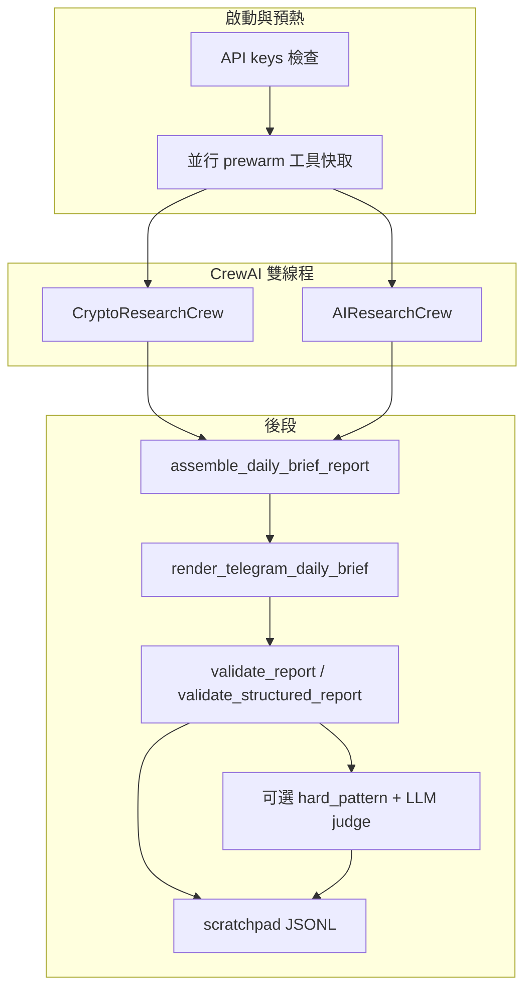

# Q-Silicon Institutional Research AI Agent

機構級 **日報管線**：以 **Python + CrewAI + LiteLLM** 並行產出 **加密市場** 與 **前沿 AI（含美股基本面）** 雙段研究 → 規則 **Gate** → 可選 **LLM 評分** → **Telegram HTML** 推送；指標可寫 **BigQuery**，並以 **Streamlit**／**PWA** 呈現戰情室。

**設計原則**：可驗證的報價、技術與宏觀數字由 **工具層抓取** 注入 Context；LLM 負責整合與敘事，**不得捏造**客觀數據。版面與標籤白名單見專案 [`.cursorrules`](.cursorrules) 與 [`docs/DAILY_BRIEF_V2.md`](docs/DAILY_BRIEF_V2.md)。

**待辦與完成度彙總** → [`TODOS.md`](TODOS.md)；**改版紀錄** → [`CHANGELOG.md`](CHANGELOG.md)。

---

## 目次

1. [架構概覽](#架構概覽)  
2. [核心模組](#核心模組)  
3. [Agent 與模型](#agent-與模型預設)  
4. [環境變數](#環境變數)  
5. [快速開始](#快速開始)  
6. [驗證與 Gate](#驗證與品質-gate摘要)  
7. [CoinGlass v4](#coinglass-api-v4)  
8. [目錄結構](#專案結構精簡)  
9. [Docker](#docker)  
10. [CI／Deploy](#cideploygithub-actions)  
11. [資料流](#資料流)  
12. [其他腳本](#其他腳本)  
13. [文件索引](#文件索引)  
14. [安全與維運](#安全與維運)  
15. [War Room PWA](#q-silicon-war-room-pwa手機版戰情室)  

---

## 架構概覽



---

## 核心模組

| 模組 | 職責 |
|------|------|
| [`main.py`](main.py) | 金鑰檢查、prewarm、雙 Crew 並行、`run_pipeline_with_retries`、Telegram、BigQuery、圖表 |
| [`crew.py`](crew.py) | `CryptoResearchCrew` / `AIResearchCrew`、Agent/Task、LLM fallback 鏈 |
| [`tools.py`](tools.py) | 搜尋／新聞／X／CoinGlass／鏈上／宏觀／Financial Datasets 等；快取與 `traced_tool_execution` |
| [`api_schema.py`](api_schema.py) | 工具回傳 JSON 結構防呆（`require_json_dict` 等） |
| [`schemas.py`](schemas.py) | `DailyBriefReport`、區塊與 QSREC 的 Pydantic 契約 |
| [`report_render.py`](report_render.py) | 結構化組裝與 Telegram HTML 模板渲染 |
| [`report_validator.py`](report_validator.py) | 戰報規則 Gate（新聞、時區、可選新聞新鮮度、QSREC、輪動等） |
| [`report_judge.py`](report_judge.py) | 硬規則字串審核；可選 `REPORT_LLM_JUDGE` |
| [`scratchpad.py`](scratchpad.py) | Run 級 JSONL；工具呼叫上限與重複偵測 |
| [`telegram_sender.py`](telegram_sender.py) | HTML 白名單清洗、分段推送、Gate 告警 |
| [`bigquery_writer.py`](bigquery_writer.py) | 指標萃取、摘要去重（可選 SBERT）、LLM run log |
| [`dashboard.py`](dashboard.py) | Streamlit 戰情室（無金鑰可啟動，BQ 區塊降級） |
| [`api.py`](api.py) | FastAPI：PWA 與戰情室資料 API |

---

## Agent 與模型（預設）

模型字串在 [`config.py`](config.py)，覆寫方式見 [`ENV_TEMPLATE.txt`](ENV_TEMPLATE.txt)。兩段 Crew 皆為 **研究員 → 風險／辯論 → 策略主編**（與 `crew.py` 一致）。

**CryptoResearchCrew**

| 角色 | LLM 槽 | 預設模型 env | API Key |
|------|--------|----------------|---------|
| 加密市場情報研究員 | Grok（fallback 鏈） | `MODEL_GROK` | `XAI_API_KEY` |
| 首席幣圈風險審計員 | Gemini | `MODEL_GEMINI` | `GEMINI_API_KEY` |
| 機構策略主編（加密） | Gemini | `MODEL_GEMINI` | `GEMINI_API_KEY` |

**AIResearchCrew**

| 角色 | LLM 槽 | 預設模型 env | API Key |
|------|--------|----------------|---------|
| 前沿 AI 市場研究員 | Grok | `MODEL_GROK` | `XAI_API_KEY` |
| 首席 AI 市場辯論員 | Gemini | `MODEL_GEMINI` | `GEMINI_API_KEY` |
| 機構策略主編（AI） | Gemini | `MODEL_GEMINI` | `GEMINI_API_KEY` |

**Fallback**：`grok` / `gemini` 各有 LiteLLM 後備鏈（`crew.py` 的 `_FALLBACK_CHAINS`）；**`ANTHROPIC_API_KEY`** 啟用 Claude 備援。`use_fallback_llm`（凌晨降級）時可將 **兩槽都改為同一顆 GPT**（`MODEL_GPT` / `OPENAI_API_KEY`）。

**其他 LLM 呼叫**：`sentiment_score_tool`（Gemini Flash → mini → OpenRouter Haiku）；`REPORT_LLM_JUDGE=1` 使用 `OPENAI_API_KEY` 與 `REPORT_LLM_JUDGE_MODEL`（預設 `openai/gpt-4o-mini`）。

費用粗估 → [`docs/COST_PER_MODEL.md`](docs/COST_PER_MODEL.md)。

---

## 環境變數

### 啟動強制檢查（`main.py`，缺則 `RuntimeError`）

`XAI_API_KEY`、`OPENAI_API_KEY`、`GEMINI_API_KEY`、`APIFY_API_TOKEN`。

其餘資料源多為**選填**；未設定時工具回傳 `[DATA_MISSING:…]` 或備援。**完整表**以 [`ENV_TEMPLATE.txt`](ENV_TEMPLATE.txt) 為準。

### 類別速查

| 類別 | 代表變數 |
|------|-----------|
| LLM 備援 | `ANTHROPIC_API_KEY`、`OPENROUTER_API_KEY` |
| 新聞／搜尋 | `NEWSAPI_KEY`、`GNEWS_API_KEY`、`TAVILY_API_KEY` |
| X（Twitter） | `TWITTER_BEARER_TOKEN`（`docker-compose`／Cloud Run 若用 `X_BEARER_TOKEN` 請對齊）；備援 `RAPIDAPI_KEY` |
| 市場數據 | `COINGLASS_API_KEY`、`CRYPTOPANIC_API_KEY`、`CRYPTOQUANT_API_KEY`、`FRED_API_KEY` |
| AI 段基本面 | `FINANCIAL_DATASETS_API_KEY` |
| 推送／雲端 | `TELEGRAM_BOT_TOKEN`、`TELEGRAM_CHAT_ID`、`GCP_PROJECT_ID` |

### 管線、Gate 與觀測（節選）

| 變數 | 說明 |
|------|------|
| `MAX_REPORT_RETRIES` | Gate 失敗後重試（預設 2） |
| `CREW_FUTURE_TIMEOUT_SEC` | 雙 Crew `future.result` 逾時秒數（預設 2700） |
| `SCRATCHPAD_ENABLED` | JSONL 軌跡（預設開） |
| `MAX_TOOL_CALLS_PER_RUN` / `REPEATED_CALL_THRESHOLD` | 工具防跑飛 |
| `ALLOW_PARTIAL_NEWS_GATE` | 3–5 則新聞 + 宣告模式（預設開；`0` 關閉） |
| `STRICT_NEWS_FRESHNESS_GATE` | 新聞時間戳須在視窗內（預設 **關**；`1` 啟用） |
| `NEWS_FRESHNESS_WINDOW_HOURS` | 新鮮度視窗小時數（預設 48） |
| `NEWS_FRESHNESS_SOURCE_WHITELIST` | 略過新鮮度檢查的來源關鍵字，逗號分隔（例 `FRED,IMF`） |
| `REPORT_LLM_JUDGE` / `REPORT_LLM_JUDGE_BLOCKING` | 可選 LLM 評分與是否阻擋 |
| `STRICT_AI_FUNDAMENTALS_CITATION` | AI 段基本面用語需 FinancialDatasets 標記（預設 0） |
| `REPORT_COMPARE_MODE` | 雙軌觀測 → [`docs/REPORT_COMPARE_STAGING.md`](docs/REPORT_COMPARE_STAGING.md) |
| `SKIP_TELEGRAM` / `SKIP_BIGQUERY` | 略過推送／BQ 寫入（本機乾跑常用） |

啟動日誌會輸出 **API key inventory**（不落密碼）。`VERIFY_API_KEYS=1` 時對部分服務做輕量探測。

---

## 快速開始

```bash
pip install -r requirements.txt
cp ENV_TEMPLATE.txt .env   # 編輯填入金鑰
python main.py
```

- 單次完整管線約 **15–30+ 分鐘**屬正常。
- 乾跑：`SKIP_TELEGRAM=1 SKIP_BIGQUERY=1 python main.py`
- 除錯：`LOG_LEVEL=DEBUG CREW_VERBOSE=1 python main.py`

**Streamlit**

```bash
streamlit run dashboard.py --server.port 8501 --server.headless true
```

**測試與 Lint**

```bash
ruff check .
pytest -m smoke -q    # 與 PR CI 對齊
pytest -q             # 完整套件（main push / 本機）
```

---

## 驗證與品質 Gate（摘要）

- **`validate_report`**：HTML／敘事規則（`〔新聞 N〕`、`UTC+8`、partial news、`trade_watch` 放寬等）；可選 **新聞新鮮度**（見上表 env）。
- **`validate_structured_report`**：Pydantic 與 QSREC（`STRICT_PICK_*` 等）。
- **`report_judge`**：硬 pattern；可選 **LLM judge**。
- Gate 失敗可寫 **`.qsilicon/last_gate_failure/`**（`GATE_FAILURE_ARTIFACTS`）；`STRICT_CONSISTENCY_GATE` 控制是否阻擋推送。

細節以 `report_validator.py`、`main.py`、`docs/DAILY_BRIEF_V2.md` 為準。

---

## CoinGlass API v4

- Base：`https://open-api-v4.coinglass.com`；Header：`CG-API-KEY`
- 成功：`code` 為 `"0"` 或 `0`；`401` / `Upgrade plan` 多為方案不含端點
- 部分指標有 **Binance 公開 API 備援**（`tools.py`）

`curl` 自測請在**已 `source` 的同一 shell** 執行（範例見 [`AGENTS.md`](AGENTS.md)）。

---

## 專案結構（精簡）

```
.
├── main.py                  # 管線入口
├── crew.py                  # 雙 Crew、六角色
├── tools.py                 # 資料與搜尋工具（大型單檔，模組化見 TODOS）
├── api_schema.py            # 工具 JSON schema guard
├── config.py
├── schemas.py
├── report_render.py
├── report_validator.py      # Gate（含可選新聞新鮮度）
├── report_judge.py
├── scratchpad.py
├── telegram_sender.py
├── bigquery_writer.py
├── dashboard.py
├── api.py                   # PWA / War Room API
├── monitor_intraday.py      # 盤中監控（workflow 見 .github）
├── core/report_validation.py
├── docs/
├── .github/workflows/       # ci, deploy, setup-scheduler, monitor-intraday
├── Dockerfile
├── data-verification-ui/    # 選用：Vite + React PWA
├── TODOS.md                 # 待辦優先序
└── AGENTS.md                # 雲端執行備忘
```

---

## Docker

```bash
docker build -t q-silicon-agent .
docker run --env-file .env q-silicon-agent
```

或使用 `docker-compose.yml`（搭配 `--env-file .env`）。

---

## CI／Deploy（GitHub Actions）

| Workflow | 觸發 | 內容 |
|----------|------|------|
| [`ci.yml`](.github/workflows/ci.yml) | **PR**；`deploy` **workflow_call** | PR：`ruff` + `pytest -m smoke`。被 deploy 呼叫：`ruff` + 完整 `pytest -v`（避免 main push 與 deploy 重複跑兩次）。 |
| [`deploy.yml`](.github/workflows/deploy.yml) | `push main`（`paths` 篩選）或手動 | 先跑 `ci.yml`，再 build／push 映像、`gcloud run jobs deploy`；同分支 **cancel-in-progress**。 |
| [`setup-scheduler.yml`](.github/workflows/setup-scheduler.yml) | 手動 | Cloud Scheduler 觸發 Job（預設台北早間等，見 workflow）。 |
| [`monitor-intraday.yml`](.github/workflows/monitor-intraday.yml) | cron 或手動 | 盤中閾值與靜默期見 workflow／`monitor_intraday.py`。 |

**Cloud Run Job** 為 **Job**（排程／手動），非長駐 HTTP。Secrets 見 `deploy.yml` 內 `--set-secrets`。

---

## 資料流

```
BigQuery 昨日摘要 / 上期 QSREC
        ↓
雙 Crew 並行（Crypto + AI）→ Pydantic 區塊
        ↓
assemble_daily_brief_report → render_telegram_daily_brief
        ↓
validate_report + validate_structured_report [+ LLM judge]
        ↓
Telegram（HTML）／BigQuery daily_metrics／logs、scratchpad
        ↓
Streamlit / PWA 讀取指標
```

---

## 其他腳本

| 命令 | 說明 |
|------|------|
| `python backtest.py` | ML 權重與回測（BQ + CoinGecko） |
| `python backfill_data.py` | 歷史指標回填 BigQuery |
| `python scripts/inject_test_data.py` | 測試資料注入（BQ 巨鯨表） |

---

## 文件索引

| 文件 | 內容 |
|------|------|
| [`TODOS.md`](TODOS.md) | 待辦／已完成驗證彙總、Backlog 編號、路線完成度 |
| [`CHANGELOG.md`](CHANGELOG.md) | 功能與行為變更紀錄（改版時請同步更新 TODOS 狀態） |
| [`CLAUDE.md`](CLAUDE.md) | 開發者導覽、常用指令、gstack |
| [`AGENTS.md`](AGENTS.md) | 雲端注意事項、CoinGlass、已知現象 |
| [`docs/DAILY_BRIEF_V2.md`](docs/DAILY_BRIEF_V2.md) | 日報版面與敘事規格 |
| [`docs/COST_PER_MODEL.md`](docs/COST_PER_MODEL.md) | LLM 費用粗估 |
| [`docs/REPORT_COMPARE_STAGING.md`](docs/REPORT_COMPARE_STAGING.md) | 雙軌驗證 |
| [`docs/ADOPTION_DEXTER_CONCEPTS.md`](docs/ADOPTION_DEXTER_CONCEPTS.md) | Dexter 式觀測概念 |
| [`docs/MCP_ASK_USER_QUESTION.md`](docs/MCP_ASK_USER_QUESTION.md) | MCP AskUserQuestion（Cursor／Claude） |
| [`gstack.md`](gstack.md) | gstack 技能 |

---

## 安全與維運

- 金鑰僅經環境變數或 Secret Manager；`.env` 與 SA JSON 勿提交（`.gitignore`）。
- Telegram 僅允許白名單 HTML（`sanitize_telegram_html`）。
- 容器建議非 root；Actions 使用 pinned 版本。

更多細節 → **AGENTS.md**。

---

## gstack（選用）

瀏覽器 QA、review、ship 等流程技能；細節見 **AGENTS.md**、**gstack.md**。

---

## Q-Silicon War Room PWA（手機版戰情室）

Telegram 作為 **推播**；PWA 作為 **閱讀與互動**（互補）。

```
FastAPI (api.py)  ←→  BigQuery (daily_metrics, trade_recommendations)
        ↓
React PWA (data-verification-ui/)
```

### 本機啟動

**後端**

```bash
pip install -r requirements.txt
uvicorn api:app --reload --port 8000
```

無 BigQuery 時 API 可能回傳錯誤／503，前端會顯示連線問題，不影響 UI 開發。

**前端**

```bash
cd data-verification-ui
npm install && npm run dev
# → http://localhost:5173（proxy /api → :8000）
```

### 頁面摘要

| 頁面 | 功能 |
|------|------|
| **今日** | Regime、KPI cards、Grok 幣圈摘要、AI 產業摘要、QSREC 卡片 |
| **圖表** | DXY／ETF 流／MVRV／風險評分；30／60／90 天 |
| **交易** | 勝率、R:R、P&L、QSREC 篩選與評分維度 |
| **存檔** | 歷史報告（例 60 天）、單日詳情 |

**卡片進階**：五維評分（催化／資金／技術／風控／執行）與 Bull／Base／Bear 三情境（信心足夠時）。

### PWA 安裝

- **iOS Safari**：分享 →「加入主畫面」
- **Android Chrome**：「安裝應用程式」或選單「加入主畫面」

### 生產部署

```bash
cd data-verification-ui && npm run build   # dist/
# Hosting：Firebase / Vercel / Cloud Run + nginx 等
```

| 變數 | 說明 |
|------|------|
| `GCP_PROJECT_ID` | BigQuery 專案 |
| `CORS_ORIGINS` | 前端 origin，逗號分隔 |

```bash
uvicorn api:app --host 0.0.0.0 --port 8000 --workers 2
```

**API 端點（節選）**

```
GET /api/metrics/latest
GET /api/metrics/history?days=30
GET /api/reports?limit=30
GET /api/reports/{YYYY-MM-DD}
GET /api/trades?status=OPEN
GET /api/trades/performance
GET /healthz
```
