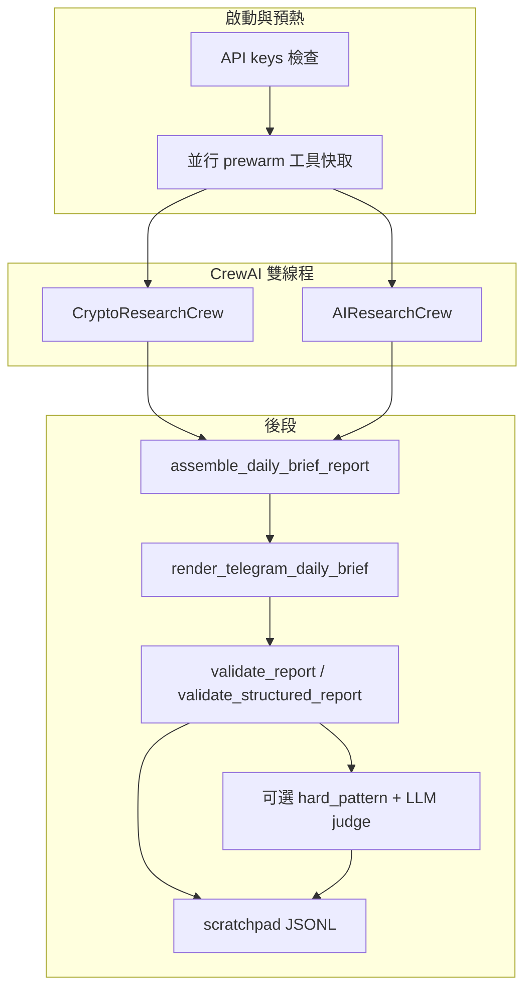

# Q-Silicon Institutional Research AI Agent

以 **Python + CrewAI + LiteLLM** 驅動的機構級日報管線：並行產出 **加密市場** 與 **前沿 AI（含美股基本面）** 雙段研究，經規則 Gate、可選 LLM 評分與 Telegram HTML 渲染後推送，並可將指標寫入 **BigQuery**、以 **Streamlit** 呈現戰情室。

**設計原則**：客觀報價、技術與宏觀數字由 **工具層抓取** 並注入 Context；LLM 負責整合與敘事，**不得捏造**可驗證數據。戰報版面與標籤規則見專案內 `.cursorrules` 與 [`docs/DAILY_BRIEF_V2.md`](docs/DAILY_BRIEF_V2.md)。

---

## 架構概覽



| 模組 | 職責 |
|------|------|
| [`main.py`](main.py) | 入口：金鑰檢查、prewarm、雙 Crew 並行、`run_pipeline_with_retries`、Telegram、BigQuery、圖表 |
| [`crew.py`](crew.py) | `CryptoResearchCrew` / `AIResearchCrew`、Agent/Task、LLM fallback 鏈 |
| [`tools.py`](tools.py) | 搜尋／新聞／X／CoinGlass／鏈上／宏觀／**Financial Datasets** 等；`_get_cache` / `_set_cache`、`traced_tool_execution` |
| [`schemas.py`](schemas.py) | `DailyBriefReport`、區塊與 QSREC 的 Pydantic 契約 |
| [`report_render.py`](report_render.py) | 結構化組裝與 Telegram HTML 模板渲染 |
| [`report_validator.py`](report_validator.py) | 戰報規則 Gate（新聞數、時區、QSREC、輪動等） |
| [`report_judge.py`](report_judge.py) | 硬規則字串審核；可選 `REPORT_LLM_JUDGE` rubric（LiteLLM） |
| [`scratchpad.py`](scratchpad.py) | Run 級 JSONL：`init`、`tool`、`gate_result`、`judge_result`；工具呼叫上限與重複偵測 |
| [`telegram_sender.py`](telegram_sender.py) | HTML 白名單清洗、分段推送、Gate 告警 |
| [`bigquery_writer.py`](bigquery_writer.py) | 指標萃取、昨日摘要排除重複、語義去重（可選 SBERT） |
| [`dashboard.py`](dashboard.py) | Streamlit 戰情室（無金鑰亦可啟動，BQ 區塊降級） |

---

## Agent 與模型（預設）

模型字串集中於 [`config.py`](config.py)，可用環境變數覆寫（見 [`ENV_TEMPLATE.txt`](ENV_TEMPLATE.txt)）。

**CryptoResearchCrew（序向：研究 → 風險 → 主編）**

| 角色 | 預設模型 | API Key 環境變數 |
|------|-----------|------------------|
| 加密市場情報研究員 | `xai/grok-4-1-fast-reasoning` | `XAI_API_KEY` |
| 首席幣圈風險審計員 | `openai/gpt-4o-mini` | `OPENAI_API_KEY`（`OPENAI_MODEL` / `MODEL_GPT`） |
| 機構策略主編（加密） | `gemini/gemini-2.5-pro` | `GEMINI_API_KEY`（`MODEL_GEMINI`） |

**AIResearchCrew（序向：研究 → 辯論 → 主編）**

| 角色 | 預設模型 | API Key 環境變數 |
|------|-----------|------------------|
| 前沿 AI 市場研究員 | `openai/gpt-4o-mini` | `OPENAI_API_KEY` |
| 首席 AI 市場辯論員 | `xai/grok-4-1-fast-reasoning` | `XAI_API_KEY` |
| 機構策略主編（AI） | `gemini/gemini-2.5-pro` | `GEMINI_API_KEY` |

**Fallback**：各槽位有 LiteLLM 後備鏈（Grok / GPT / Claude），需 **`ANTHROPIC_API_KEY`** 才能啟用 Claude 備援。`use_fallback_llm` 時全槽改為同一顆 GPT（凌晨降級路徑）。

**其他 LLM 呼叫**

- `sentiment_score_tool`：依序嘗試 Gemini Flash → `gpt-4o-mini` → OpenRouter Haiku（需對應金鑰）。
- `REPORT_LLM_JUDGE=1`：使用 `OPENAI_API_KEY` 與 `REPORT_LLM_JUDGE_MODEL`（預設 `openai/gpt-4o-mini`）。

費用粗估見 [`docs/COST_PER_MODEL.md`](docs/COST_PER_MODEL.md)。

---

## 必要與建議環境變數

啟動時 **`main.py` 強制檢查**（缺則 `RuntimeError`）：`XAI_API_KEY`、`OPENAI_API_KEY`、`GEMINI_API_KEY`、`APIFY_API_TOKEN`。

其餘資料源為**選填**；未設定時相關工具回傳 `[DATA_MISSING:…]` 或走備援。**完整列表與註解**以 [`ENV_TEMPLATE.txt`](ENV_TEMPLATE.txt) 為準。

| 類別 | 代表變數 |
|------|-----------|
| LLM 備援 | `ANTHROPIC_API_KEY`、`OPENROUTER_API_KEY` |
| 新聞／搜尋 | `NEWSAPI_KEY`、`GNEWS_API_KEY`、`TAVILY_API_KEY`（若工具使用） |
| X（Twitter） | **`TWITTER_BEARER_TOKEN`**（`x_search_tool`）；`docker-compose`／Cloud Run 範本若使用 `X_BEARER_TOKEN`，請在執行環境對應到同一值。備援：`RAPIDAPI_KEY` |
| 市場數據 | `COINGLASS_API_KEY`、`CRYPTOPANIC_API_KEY`、`CRYPTOQUANT_API_KEY`、`FRED_API_KEY` |
| AI 段基本面 | `FINANCIAL_DATASETS_API_KEY` |
| 推送／雲端 | `TELEGRAM_BOT_TOKEN`、`TELEGRAM_CHAT_ID`、`GCP_PROJECT_ID` |

**管線與觀測（節選）**

| 變數 | 說明 |
|------|------|
| `MAX_REPORT_RETRIES` | Gate 失敗後重試次數（預設 2） |
| `CREW_FUTURE_TIMEOUT_SEC` | 雙 Crew `future.result` 逾時秒數（預設 2700） |
| `SCRATCHPAD_ENABLED` | JSONL 軌跡（預設開） |
| `MAX_TOOL_CALLS_PER_RUN` / `REPEATED_CALL_THRESHOLD` | 工具防跑飛 |
| `REPORT_LLM_JUDGE` / `REPORT_LLM_JUDGE_BLOCKING` | 可選 LLM 評分與是否阻擋 |
| `STRICT_AI_FUNDAMENTALS_CITATION` | AI 段基本面用語時需出現 FinancialDatasets 標記（預設 0） |
| `REPORT_COMPARE_MODE` | 雙軌驗證觀測，見 [`docs/REPORT_COMPARE_STAGING.md`](docs/REPORT_COMPARE_STAGING.md) |

啟動日誌會輸出 **API key inventory**（不落密碼）。`VERIFY_API_KEYS=1` 時對 NewsAPI、Apify 做輕量 HTTP 探測。

---

## 快速開始

```bash
pip install -r requirements.txt
cp ENV_TEMPLATE.txt .env   # 再編輯填入金鑰
python main.py
```

- 單次完整管線約 **15–30+ 分鐘**屬正常（多輪工具與 LLM）。
- 乾跑：`SKIP_TELEGRAM=1 SKIP_BIGQUERY=1 python main.py`
- 除錯：`LOG_LEVEL=DEBUG CREW_VERBOSE=1 python main.py`

**Streamlit 戰情室**

```bash
streamlit run dashboard.py --server.port 8501 --server.headless true
```

**測試與 Lint**

```bash
ruff check .
pytest -m smoke -q          # PR 路徑
pytest -q                   # 完整套件（push main / 本機）
```

---

## 驗證與品質 Gate（摘要）

- **`validate_report`**：HTML／敘事規則（新聞則數與 `〔新聞 N〕`、`UTC+8`、partial news 模式、`trade_watch` 放寬條件等）。
- **`validate_structured_report`**：Pydantic 與 QSREC 欄位（評分、輪動、選擇理由等；見 `STRICT_PICK_*` 系列 env）。
- **Hard pattern judge**（`report_judge`）：關鍵詞／格式硬檢。
- **可選 LLM judge**：`REPORT_LLM_JUDGE=1`，結果寫入 scratchpad。
- Gate 失敗可寫入 **`.qsilicon/last_gate_failure/`**（見 `GATE_FAILURE_ARTIFACTS`）；`STRICT_CONSISTENCY_GATE` 控制是否阻擋正式推送。

細節與邊界條件以 `report_validator.py`、`main.py` 及 [`docs/DAILY_BRIEF_V2.md`](docs/DAILY_BRIEF_V2.md) 為準。

---

## CoinGlass API v4

- Base：`https://open-api-v4.coinglass.com`
- Header：`CG-API-KEY: <COINGLASS_API_KEY>`
- 成功：`code` 為 `"0"` 或 `0`；`401` / `Upgrade plan` 多為方案不含端點，非 URL 拼錯
- 部分指標對 BTC 等有 **Binance 公開 API 備援**（見 `tools.py`）

自測請在**已載入 `.env` 的同一 shell** 執行 `curl`（見 [`AGENTS.md`](AGENTS.md) 範例）。

---

## 專案結構（精簡）

```
.
├── main.py                 # 管線入口
├── crew.py                 # 雙 Crew、六角色
├── tools.py                # 資料與搜尋工具
├── config.py               # 專案 ID、BQ 表名、LLM 預設模型
├── schemas.py              # DailyBriefReport 契約
├── report_render.py        # HTML 渲染
├── report_validator.py     # Gate
├── report_judge.py         # 硬檢 + 可選 LLM judge
├── scratchpad.py           # JSONL 與工具防跑飛
├── telegram_sender.py
├── bigquery_writer.py
├── dashboard.py
├── core/report_validation.py   # 候選驗證路徑（比對模式用）
├── docs/                   # 規格與導入說明
├── .github/workflows/      # ci.yml、deploy.yml、setup-scheduler.yml
├── Dockerfile
├── data-verification-ui/   # 選用：Vite + React
└── AGENTS.md               # Cursor / 雲端執行備忘
```

---

## Docker

```bash
docker build -t q-silicon-agent .
docker run --env-file .env q-silicon-agent
```

或使用 `docker-compose.yml`（`--env-file .env`）。

---

## 部署：Cloud Run Job

- 型態：**Job**（排程或手動），非長駐 HTTP。
- **CI**：PR 跑 `ruff` + `pytest -m smoke`；push `main` 在特定 paths 變更時跑完整測試（見 [`.github/workflows/ci.yml`](.github/workflows/ci.yml)）。
- **Deploy**：變更觸發或手動 **Deploy — Cloud Run Job**（build → Artifact Registry → `gcloud run jobs deploy`）；Secrets 見 workflow 內 `set-secrets`。
- **排程**：可執行一次 [`setup-scheduler.yml`](.github/workflows/setup-scheduler.yml) 建立 Cloud Scheduler。

---

## 資料流

```
BigQuery 昨日摘要 / 上期 QSREC
        ↓
雙 Crew 並行（Crypto + AI）→ Pydantic 區塊
        ↓
assemble_daily_brief_report → render_telegram_daily_brief
        ↓
validate_report + validate_structured_report [+ LLM judge]
        ↓
Telegram（HTML）／BigQuery daily_metrics／logs、scratchpad
        ↓
Streamlit 戰情室讀取指標
```

---

## 其他腳本

| 命令 | 說明 |
|------|------|
| `python backtest.py` | ML 權重與回測（BQ + CoinGecko） |
| `python backfill_data.py` | 歷史指標回填 BigQuery |
| `python inject_test_data.py` | 測試資料注入 |

---

## 文件索引

| 文件 | 內容 |
|------|------|
| [`CLAUDE.md`](CLAUDE.md) | 開發者指令、常用指令、gstack |
| [`AGENTS.md`](AGENTS.md) | 雲端注意事項、CoinGlass、已知現象 |
| [`docs/DAILY_BRIEF_V2.md`](docs/DAILY_BRIEF_V2.md) | 日報版面與敘事規格 |
| [`docs/COST_PER_MODEL.md`](docs/COST_PER_MODEL.md) | LLM 費用粗估 |
| [`docs/ADOPTION_DEXTER_CONCEPTS.md`](docs/ADOPTION_DEXTER_CONCEPTS.md) | Dexter 式觀測與工具導入概念 |
| [`docs/REPORT_COMPARE_STAGING.md`](docs/REPORT_COMPARE_STAGING.md) | 雙軌驗證 |
| [`gstack.md`](gstack.md) | gstack 技能（瀏覽器／流程） |

---

## 安全與維運

- 金鑰僅經環境變數或 Secret Manager 注入；`.env` 與 SA JSON 勿提交（見 `.gitignore`）。
- Telegram 僅允許白名單 HTML 標籤（`sanitize_telegram_html`）。
- 容器內建議非 root；CI Actions 使用 pinned 版本。

更多運維細節見 **AGENTS.md**。

---

## gstack（選用）

更細的維運與已知問題見 **AGENTS.md**。

---

## Q-Silicon War Room PWA（手機版戰情室）

### 架構概覽

```
FastAPI 後端 (api.py)  ←─  BigQuery (daily_metrics + trade_recommendations)
        ↓
React PWA (data-verification-ui/)
        ↓ 安裝至手機主畫面
  📊 今日  /  📈 圖表  /  💼 交易  /  🗄 存檔
```

Telegram 繼續作為 **推播通知** 入口，PWA 作為 **閱讀與互動** 主平台（兩者互補，不互斥）。

---

### 本機啟動

**1. 啟動 FastAPI 後端**

```bash
# 安裝依賴（已含 fastapi + uvicorn）
pip install -r requirements.txt

# 啟動 API（需要 GCP credentials / BigQuery 連線）
uvicorn api:app --reload --port 8000
```

無 BigQuery 時 API 回傳 503，前端顯示 "無法連線至 API"，不影響開發。

**2. 啟動前端開發伺服器**

```bash
cd data-verification-ui
npm install
npm run dev
# → http://localhost:5173（自動 proxy /api → localhost:8000）
```

---

### 頁面功能說明

| 頁面 | 功能 |
|------|------|
| 📊 **今日** | 市場模式 badge（Risk ON/OFF/中性）、DXY/ETF流/MVRV/風險評分 KPI cards、Grok 幣圈情報、AI 產業摘要、今日 QSREC 建議卡片 |
| 📈 **圖表** | DXY / ETF 資金流 / MVRV Z-Score / 風險評分 互動折線圖，支援 30 / 60 / 90 天切換 |
| 💼 **交易** | 勝率 / 平均 R:R / 平均 P&L 統計、全部/持倉中/達標/停損篩選、QSREC 建議卡片含 **評分維度 bar chart + 三情境分析** |
| 🗄 **存檔** | 歷史報告清單（60 天），點入查看單日完整數據 + QSREC |

---

### 交易卡片進階功能（P4）

每張 QSREC 建議卡片可展開「**評分 & 情境分析**」：

**五維評分雷達（0–100）**

| 維度 | 說明 |
|------|------|
| 催化（Catalyst） | 新聞事件 / ETF / 監管催化強度 |
| 資金（Flow） | ETF 流入 / 鏈上淨流向 / 資金費率訊號 |
| 技術（Technical） | 多時框一致性、均線結構、RSI/OI |
| 風控（Risk Fit） | 與當日 regime 的倉位契合度 |
| 執行（Execution） | 流動性、進場區間實用性 |

**三情境分析**（信心 ≥ 3 星時填入）

| 情境 | 說明 |
|------|------|
| 🐂 Bull | 樂觀目標價 + 觸發條件 |
| ⚖️ Base | 基準預期 + 機率估算 |
| 🐻 Bear | 失效位 + 風險觸發條件 |

---

### 手機安裝（PWA）

**iOS（Safari）**

1. 瀏覽器開啟 PWA 網址
2. 點擊底部 **分享** 按鈕
3. 選擇「**加入主畫面**」
4. 確認後桌面出現「Q-Silicon War Room」app 圖示

**Android（Chrome）**

1. 瀏覽器開啟 PWA 網址
2. 瀏覽器提示「**安裝應用程式**」→ 點安裝
3. 或：選單 → 「**加入主畫面**」

安裝後以全螢幕深色介面開啟，無瀏覽器工具列。

---

### 部署（生產環境）

**前端 Build**

```bash
cd data-verification-ui
npm run build        # 輸出 dist/
# 部署至 Firebase Hosting / Vercel / Cloud Run (nginx)
```

**API 環境變數**

| 變數 | 說明 | 預設 |
|------|------|------|
| `GCP_PROJECT_ID` | BigQuery 專案 ID | `my-investment-ai-agent` |
| `CORS_ORIGINS` | 前端 origin 清單（逗號分隔） | `http://localhost:5173,...` |

```bash
# 生產啟動
uvicorn api:app --host 0.0.0.0 --port 8000 --workers 2
```

**API 端點一覽**

```
GET /api/metrics/latest          最新 KPI + 日環比
GET /api/metrics/history?days=30 歷史趨勢（7–180天）
GET /api/reports?limit=30        報告清單
GET /api/reports/{YYYY-MM-DD}    單日報告 + QSREC 建議
GET /api/trades?status=OPEN      交易建議（可篩 status/days）
GET /api/trades/performance      勝率/R:R/P&L 統計
GET /healthz                     健康檢查
```
