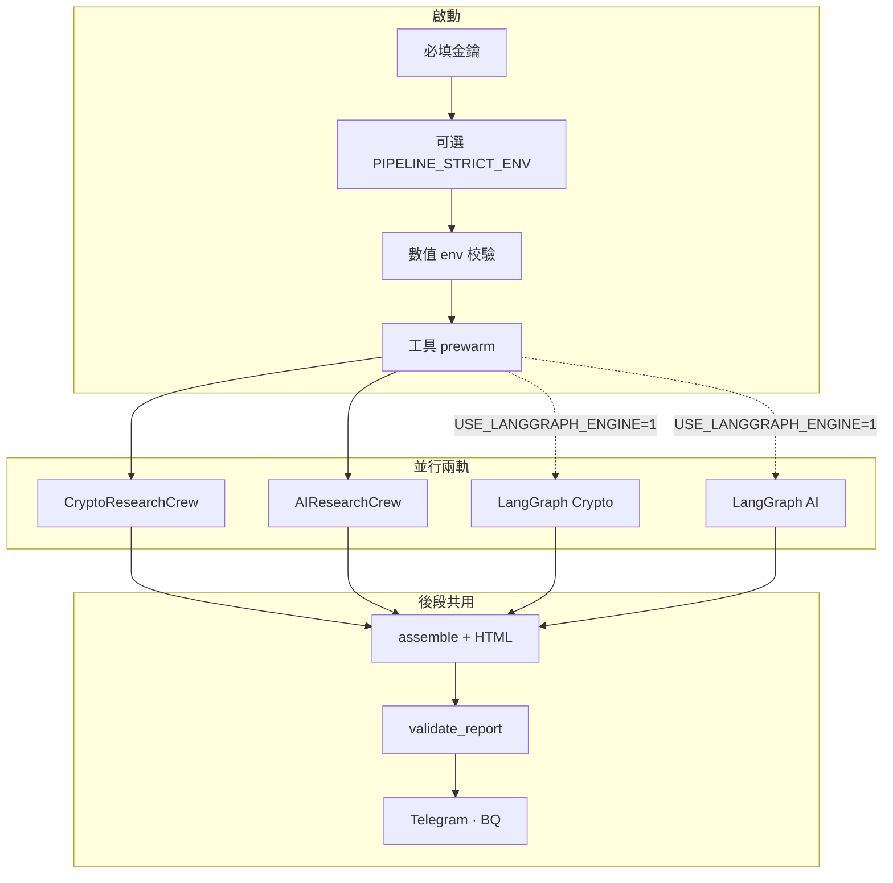

# Q-Silicon Institutional Research AI Agent

[](LICENSE)
[](https://www.python.org/downloads/)
[](.github/workflows/ci.yml)

以 **Python** 串起 **CrewAI**、**LiteLLM** 與可選 **LangGraph**，並行產出 **加密** 與 **AI／美股** 研究；經 **Pydantic** 與 **`validate_report`** 後輸出 **Telegram HTML**。客觀數字來自工具與 API 注入，而非模型臆測。可選 **BigQuery**、**Streamlit**、**FastAPI** 與 **React PWA**。授權與本 repo 根目錄 [`LICENSE`](LICENSE) 一致（MIT）。

| 連結 | 用途 |
|------|------|
| 授權 | [`LICENSE`](LICENSE)（MIT）·[`CONTRIBUTING.md`](CONTRIBUTING.md) · [`CODE_OF_CONDUCT.md`](CODE_OF_CONDUCT.md) |
| 待辦 | [`TODOS.md`](TODOS.md) |
| 變更紀錄 | [`CHANGELOG.md`](CHANGELOG.md) |
| 執行路線圖 | [`docs/REPO_CONTINUATION_EXECUTION.md`](docs/REPO_CONTINUATION_EXECUTION.md) |
| 開發導覽 | [`CLAUDE.md`](CLAUDE.md) · [`AGENTS.md`](AGENTS.md) |
| 環境變數 | [`ENV_TEMPLATE.txt`](ENV_TEMPLATE.txt) → 複製為 `.env` |
| 日報版面 | [`docs/DAILY_BRIEF_V2.md`](docs/DAILY_BRIEF_V2.md) |
| 日報模組化（路線圖，計畫文件） | [`modularization_plan.md`](modularization_plan.md) |

**本 README 對齊 repo 現況（持續更新；重大變更見 [`CHANGELOG.md`](CHANGELOG.md)）。** 細節與紅線亦見 [`.cursorrules`](.cursorrules)。

### 日報模組化（計畫文件 + 已落地切片）

多 profile（`full`／`lite`／`crypto-only`）、`templates/blocks/` macro、`brief_profiles`／`BLOCK_REGISTRY`、profile-aware **`validate_report`**，以及 Phase 4c（BQ `profile`）／Phase 5（【時事多觀點】）之**短／中／長期**切分，見根目錄 [`modularization_plan.md`](modularization_plan.md)。**已交付**：Phase 1（**2026-04-26**，`templates/blocks/` + smoke byte 對齊）、Phase 2–3（**2026-04-27**，`REPORT_PROFILE`、`templates/profiles/`、`main.py` 傳 profile、Gate `profile=`）、**Phase 4a**（**2026-04-27**，`telegram_crypto_only`、`REPORT_PROFILE=crypto-only`）、**Phase 4b**（**2026-04-27**，[`config/brief_layouts/`](config/brief_layouts/)、`BRIEF_LAYOUT_FILE`、`brief_profiles_layout`、`profile_block_ids` merge）、**Phase 4c**（**2026-04-16**，[`bigquery_writer.py`](bigquery_writer.py) `llm_run_log`／`gate_failure_log` 寫入 **`profile`**，見 [`docs/SQL/bq_brief_profile_columns.sql`](docs/SQL/bq_brief_profile_columns.sql)）；預設 **`full`** 與凍結基線 **byte-identical** — 見 [`CHANGELOG.md`](CHANGELOG.md) **2026-04-16**／**2026-04-26**／**2026-04-27**。**仍待**：Phase 5（見 [`TODOS.md`](TODOS.md) 隊列 **22**）。後續實作仍須遵守 **Telegram HTML 白名單**與 **無數據幻覺**（見上表「日報版面」）。

---

## 設計紅線

1. **無數據幻覺**：價格、指標、宏觀數字須由 **Python 工具／API** 取得並寫入 context；LLM 不得捏造。
2. **X／Twitter**：日報主線 **不依賴** X 搜尋。
3. **Telegram HTML**：僅 `<b>` `<i>` `<u>` `<s>` `<code>` `<blockquote>` `<a>`；區塊順序：儀表板 → 核心新聞 → 呢喃 → 精準操作（見 `DAILY_BRIEF_V2`）。

---

## 我想做什麼？

| 目標 | 指令或步驟 | 需要金鑰？ |
|------|------------|------------|
| 戰情室 UI | `streamlit run dashboard.py --server.port 8501 --server.headless true` | 否（BQ 區塊降級） |
| PWA 版型 | `cd data-verification-ui && npm install && VITE_GLASSBOX_MOCK=1 npm run dev` | 否 |
| PWA Terminal（代號快照／K 線） | 同上；開啟 **`/terminal`**。接實盤 API 時設 **`VITE_API_URL`**（例：`VITE_API_URL=http://127.0.0.1:8000 npm run dev`） | 否（mock）；是（讀 BQ 需本機 `uvicorn` + GCP） |
| PWA E2E（Playwright） | `cd data-verification-ui && npm run test:e2e`（內建 mock API + `VITE_E2E=1` 建置；Bloomberg §6 Today vs `/terminal` BTC 價） | 否（需下載 Chromium） |
| 對齊 CI | `ruff check .` · `python3 -m pytest -m smoke -q` · `./scripts/ci_terminal_contract_check.sh`（quote／OHLC 契約 + PWA build；GitHub Actions 對 `data-verification-ui/package.json` 啟用 **npm cache**） | 否（PWA build 需 Node） |
| 乾跑管線 | `SKIP_TELEGRAM=1 SKIP_BIGQUERY=1 python main.py` | 是（啟動四項 LLM／資料 key，見下） |
| LangGraph 路徑 | `USE_LANGGRAPH_ENGINE=1 python main.py` | 與上同；見 [LangGraph](#langgraph-可選) |
| 生產式檢查 | `PIPELINE_STRICT_ENV=1`（未 skip 時強制 Telegram／GCP） | 是 |

**啟動必填（缺一則 `RuntimeError`）**：`XAI_API_KEY`、`OPENAI_API_KEY`、`GEMINI_API_KEY`、`APIFY_API_TOKEN`。

**常見狀況**：`main.py` 單次 **15–30+ 分鐘**屬正常；Gate 擋報看終端 `issues`，可開 `GATE_FAILURE_ARTIFACTS=1`；CoinGlass `401`／`Upgrade plan` 多為方案不含端點（見 [CoinGlass](#coinglass-api-v4)）。

---

## 快速開始

```bash
pip install -r requirements.txt
cp ENV_TEMPLATE.txt .env   # 編輯填入金鑰
python main.py
```

| 情境 | 環境變數或指令 |
|------|----------------|
| 乾跑 | `SKIP_TELEGRAM=1 SKIP_BIGQUERY=1 python main.py` |
| 除錯 | `LOG_LEVEL=DEBUG CREW_VERBOSE=1 python main.py` |
| 雙軌比對 | `REPORT_COMPARE_MODE=1 python main.py` → [`docs/REPORT_COMPARE_STAGING.md`](docs/REPORT_COMPARE_STAGING.md) |

### 日報品質代理（可選）

在 **`.env`**（由 [`ENV_TEMPLATE.txt`](ENV_TEMPLATE.txt) 複製）手動加入：

- **`REPORT_QUALITY_AGENT=1`** — `validate_report` 通過後跑 [`report_quality_agent.py`](report_quality_agent.py)（不取代 Gate）。
- **`OPENAI_API_KEY`** — 已為管線必填；品質代理的 LLM rubric 與 **`REPORT_LLM_JUDGE_MODEL`** 相同，程式預設 **`openai/gpt-4o-mini`**（若要明確寫死可設 `REPORT_LLM_JUDGE_MODEL=openai/gpt-4o-mini`）。
- 其餘門檻／`git push` 行為見 `ENV_TEMPLATE.txt` 註解（**勿**隨意開 `REPORT_QUALITY_AGENT_GIT_PUSH`）。

載入 `.env` 後執行：`set -a && source .env && set +a && python main.py`。詳見 [`TODOS.md`](TODOS.md) 與 CHANGELOG。

**Python**：Dockerfile 為 3.11-slim；本機 3.12 通常可。專案為根目錄扁平腳本，**無** `pyproject.toml`。

---

## 架構概覽

`main.py` 以 **雙 `ThreadPoolExecutor`** 並行 Crypto／AI，每軌可選 **CrewAI** 或 **LangGraph**，最後共用 **assemble → render → validate**。



---

## LangGraph（可選）

目錄 [`graph/`](graph/)：`graph_state.py`（含 `merge_raw_data` reducer）、`graph_nodes.py`、`graph_crew.py`、`graph_tools.py`。

| 節點／檔案 | 說明 |
|------------|------|
| `data_gatherer` | 寫入 `raw_data`（受 `GRAPH_ENABLE_TOOL_CALLS` 控制） |
| `bull_agent` / `bear_agent` | `GRAPH_LLM_DEBATE=1` 時走即時 LLM；否則規則式 |
| `arbiter` | 決定 `needs_deep_dive` / `deep_dive_query` |
| `deep_research` | 預設決定性補抓；`GRAPH_DEEP_RESEARCH_TOOL_LLM=1` 時 **`bind_tools(RESEARCH_TOOLS)`** 多輪真實呼叫（需金鑰） |
| `final_formatter` | 預設交回 `CryptoResearchCrew`／`AIResearchCrew`；`LANGGRAPH_SKIP_FORMATTER_CREW=1` 僅 smoke |

**`graph_tools.py`**：以 LangChain `StructuredTool` 包裝 `coinglass_data_tool`、`financial_datasets_tool`、`newsapi_tool` → **`RESEARCH_TOOLS`**。

| 變數 | 預設 | 用途 |
|------|------|------|
| `USE_LANGGRAPH_ENGINE` | `0` | `1` 啟用 LangGraph 雙軌 |
| `GRAPH_ENABLE_TOOL_CALLS` | `1` | `0` 關閉 gatherer／deep 內工具 HTTP |
| `GRAPH_LLM_DEBATE` | `0` | `1` Bull／Bear／Arbiter 用 ChatOpenAI |
| `GRAPH_DEEP_RESEARCH_TOOL_LLM` | `0` | `1` 深度查證用 bind_tools 閉環 |
| `LANGGRAPH_SKIP_FORMATTER_CREW` | `0` | `1` 測試用，不跑完整 Crew |

完整列表見 [`ENV_TEMPLATE.txt`](ENV_TEMPLATE.txt)。

---

## 核心檔案

| 路徑 | 角色 |
|------|------|
| [`main.py`](main.py) | 啟動、prewarm、雙軌、重試、Telegram、BQ |
| [`crew.py`](crew.py) | CrewAI agents／tasks、fallback 鏈 |
| [`graph/`](graph/) | 可選狀態機與工具橋接 |
| [`tools/`](tools/) · [`tools_legacy.py`](tools_legacy.py) | 市場／新聞／鏈上工具；`MOCK_APIS` 見 ADR |
| [`schemas.py`](schemas.py) | `DailyBriefReport`、QSREC、結構化驗證 |
| [`report_render.py`](report_render.py) · [`templates/telegram_report.j2`](templates/telegram_report.j2) · [`templates/profiles/`](templates/profiles/) · [`brief_profiles.py`](brief_profiles.py) · [`brief_profiles_layout.py`](brief_profiles_layout.py) · [`config/brief_layouts/`](config/brief_layouts/) | 組裝與 Telegram HTML；可選 **`REPORT_PROFILE=lite`** 或 **`crypto-only`**；可選 **`BRIEF_LAYOUT_FILE`** YAML 重排粗粒度 block 順序（預設 `full`，與凍結基線 **byte-identical**；見 `ENV_TEMPLATE.txt`、`config/brief_layouts/README.md`） |
| [`report_html_gates.py`](report_html_gates.py) | `validate_report` |
| [`telegram_sender.py`](telegram_sender.py) · [`bigquery_writer.py`](bigquery_writer.py) | 推送、metrics、`write_gate_failure_log` |
| [`api.py`](api.py) · [`dashboard.py`](dashboard.py) | FastAPI、Streamlit |

---

## 模型與 Agent 槽位

詳見 [`config.py`](config.py) 與 [`ENV_TEMPLATE.txt`](ENV_TEMPLATE.txt)。Crypto／AI 皆為 **研究員（Grok）→ 審計／辯論（Gemini）→ 主編（Gemini）** 型流程；備援鏈在 `crew.py`。

---

## 環境變數摘錄

除啟動四項外，常見還有：`NEWSAPI_KEY`、`TAVILY_API_KEY`、`COINGLASS_API_KEY`、`FRED_API_KEY`、`FINANCIAL_DATASETS_API_KEY`、`TELEGRAM_*`、`GCP_*`、可選 **`STRICT_INSTITUTIONAL_PHASE_A_GATE`**／**B**／**C**、**`STRICT_NEWS_FRESHNESS_GATE`**、**`EARNINGS_FOCUS_MODE`**（財報日／週末預告 exclusion，見 [`earnings_focus.py`](earnings_focus.py)、[`earnings_watchlist.py`](earnings_watchlist.py)）等。**權威列表**：`ENV_TEMPLATE.txt`。

**Mega-cap／AI 財報 watchlist**（yfinance 日曆掃描與財報聚焦共用；含矽光子／光通訊、AI 伺服器／ODM、資料中心網路等公開敘事常見標的，非即時熱度排名）：`NVDA`、`AMD`、`INTC`、`AVGO`、`MRVL`、`QCOM`、`MU`、`TSM`、`ARM`、`SMCI`、`DELL`、`HPE`、`MSFT`、`GOOGL`、`AAPL`、`META`、`AMZN`、`ORCL`、`CRM`、`NOW`、`SNOW`、`PLTR`、`CRWD`、`NET`、`ANET`、`CSCO`、`LITE`、`COHR`、`FN`。

---

## 驗證與觀測

- **`validate_report`**：HTML 規則（新聞則數、`UTC+8`、`trade_watch`、partial news 等）。
- **結構化**：`schemas.py` 與 QSREC 業務規則。
- **本機**：`.qsilicon/last_gate_failure/`（`GATE_FAILURE_ARTIFACTS=1`）。
- **BQ**：`gate_failure_log`（`GATE_FAILURE_BQ_LOG`）；SQL 範例 [`docs/SQL/gate_failure_weekly_summary.sql`](docs/SQL/gate_failure_weekly_summary.sql)。

---

## 開發與測試

```bash
ruff check .
python3 -m pytest -m smoke -q    # 與 PR CI 對齊（requirements-ci.txt）
python3 -m pytest -v             # 全量
python3 -m pytest -m boundary -v
./scripts/bench_autoresearch.sh
```

PR／deploy 使用輕量 [`requirements-ci.txt`](requirements-ci.txt) 與 [`conftest.py`](conftest.py) stub。全量測試若含 Hypothesis 需另行 `pip install hypothesis`。

---

## 目錄結構（精簡）

```
main.py, crew.py, config.py, schemas.py
graph/
tools/, tools_legacy.py
report_*.py, validation_rules.py
api.py, dashboard.py
templates/telegram_report.j2
docs/, scripts/, core/
data-verification-ui/
.github/workflows/
ENV_TEMPLATE.txt, TODOS.md, CHANGELOG.md, CLAUDE.md
```

---

## Docker

```bash
docker build -t q-silicon-agent .
docker run --env-file .env q-silicon-agent
```

---

## CI／GitHub Actions

| Workflow | 說明 |
|----------|------|
| [`ci.yml`](.github/workflows/ci.yml) | PR：`ruff` + smoke；可 `workflow_dispatch` quick／full |
| [`deploy.yml`](.github/workflows/deploy.yml) | `main` 且變更命中 **`paths`**（`*.py`／Docker／依賴等）才自動跑 smoke → Docker；**純 `.md`／文件 push 不觸發**。需部署時：**Actions** → 本 workflow → **Run workflow**。 |
| [`nightly-ci.yml`](.github/workflows/nightly-ci.yml) | 全量 pytest |
| [`monitor-intraday.yml`](.github/workflows/monitor-intraday.yml) | 盤中監控（cron 預設關） |
| [`weekly-scout.yml`](.github/workflows/weekly-scout.yml) | OSS scout |

部署與人工閘門：[`docs/DEPLOY_RUNBOOK.md`](docs/DEPLOY_RUNBOOK.md)。

---

## 資料流（一句話）

BQ／排除 context → 雙軌研究 → assemble／render →（可選 editor）→ validate → Telegram／BQ／儀表與 PWA。

---

## 輔助腳本

| 腳本 | 用途 |
|------|------|
| [`scripts/bench_autoresearch.sh`](scripts/bench_autoresearch.sh) | Lint + smoke + METRIC |
| [`scripts/write_ml_weights.py`](scripts/write_ml_weights.py) | ML 權重 |
| [`scripts/run_mock_smoke.sh`](scripts/run_mock_smoke.sh) | `MOCK_APIS=1` smoke |
| `python backtest.py` | 回測 |

---

## 文件索引

| 主題 | 路徑 |
|------|------|
| 閾值實驗 | [`docs/STAGING_THRESHOLD_EXPERIMENT.md`](docs/STAGING_THRESHOLD_EXPERIMENT.md) |
| Critical env | [`docs/CRITICAL_ENV_POLICY.md`](docs/CRITICAL_ENV_POLICY.md) |
| Gate 人審 | [`docs/GATE_FAILURE_HINT_WORKFLOW.md`](docs/GATE_FAILURE_HINT_WORKFLOW.md) |
| 儀表契約 | [`docs/DASHBOARD_CONTRACT.md`](docs/DASHBOARD_CONTRACT.md) |
| Bloomberg 對齊（工作流藍圖） | [`docs/BLOOMBERG_ALIGNMENT.md`](docs/BLOOMBERG_ALIGNMENT.md) |
| 選幣輪動 | [`docs/PICK_ROTATION_SEMANTICS.md`](docs/PICK_ROTATION_SEMANTICS.md) |
| 邊界測試 | [`docs/BOUNDARY_TEST_MATRIX.md`](docs/BOUNDARY_TEST_MATRIX.md) |
| 工具 ADR | [`docs/ADR_OFFICE_HOURS_TOOLS_PLATFORM.md`](docs/ADR_OFFICE_HOURS_TOOLS_PLATFORM.md) |
| 路線願景 | [`docs/ROADMAP_VISION.md`](docs/ROADMAP_VISION.md) |

---

## CoinGlass API v4

- Base：`https://open-api-v4.coinglass.com`，Header：`CG-API-KEY`
- 成功：`code` 為 `"0"` 或 `0`
- `401`／Upgrade：多為方案不含端點；部分指標有 Binance 等備援

---

## 安全與維運

勿提交 `.env` 與服務帳戶 JSON；Telegram 輸出經白名單清洗。

---

## War Room PWA 與 API

Mock：`cd data-verification-ui && VITE_GLASSBOX_MOCK=1 npm run dev`。  
本機後端：`uvicorn api:app --reload --port 8000`（需 GCP 讀 BQ）。細節見 [`docs/DASHBOARD_CONTRACT.md`](docs/DASHBOARD_CONTRACT.md)。

- **路由**：底部導覽「終端」→ **`/terminal`**（watchlist 存 `localStorage`；代號卡呼叫 `GET /api/symbols/{symbol}/snapshot` 與輕量 **`GET /api/symbols/{symbol}/quote`**（最新日線收盤／1D%，僅 yfinance））。
- **`VITE_API_URL`**：Vite 建置時注入；未設時請求為**同源相對路徑**（適合 PWA 與 API 同網域反代）。本機前後端分埠時例：`VITE_API_URL=http://127.0.0.1:8000 npm run dev`。
- **`VITE_TERMINAL_POLL_MS`**（可選）：**`/terminal`** 內 snapshot／意圖列表／War Room 輪詢間隔（毫秒），預設 **45000**；本機除錯可設 `15000`。見 [`docs/TERMINAL_MID_TIER_ROADMAP.md`](docs/TERMINAL_MID_TIER_ROADMAP.md)。
- **SSE（可選）**：後端 `TERMINAL_SSE_ENABLED=1` 時提供 `GET /api/stream/war-room`；前端 **`VITE_SSE_ENABLED=1`**，若設 `API_STREAM_AUTH_KEY` 則同步 **`VITE_SSE_STREAM_KEY`**。紙上一輪：`python scripts/paper_execution_tick.py` 或 `PAPER_TICK_HTTP_ENABLED=1` 時 `POST /api/paper/execution-tick`（可選 `PAPER_TICK_API_KEY`）。
- **產品對齊說明**：[`docs/BLOOMBERG_ALIGNMENT.md`](docs/BLOOMBERG_ALIGNMENT.md)（能力映射與驗收；非外觀複製 Terminal）。
- **實盤價格觀測（BQ vs yfinance）**：`python scripts/symbol_price_probe.py BTC`（stdout JSON）；可選 `PRICE_PROBE_WRITE_BQ=1` + `PRICE_PROBE_LOG_TABLE=…` 寫入 BQ（建表 [`docs/SQL/price_probe_log.sql`](docs/SQL/price_probe_log.sql)）。
- **Web Push（T4a）**：[`docs/PWA_WEB_PUSH.md`](docs/PWA_WEB_PUSH.md) — `WEB_PUSH_REDIS_URL`、`WEB_PUSH_VAPID_*`、`POST /api/push/test-send`（`WEB_PUSH_ADMIN_KEY`）；產鑰 `python scripts/vapid_generate.py`。

---

## gstack（選用）

瀏覽器 QA、review、ship 等流程 — 見 [`AGENTS.md`](AGENTS.md) 與 [`gstack.md`](gstack.md)（若存在）。
