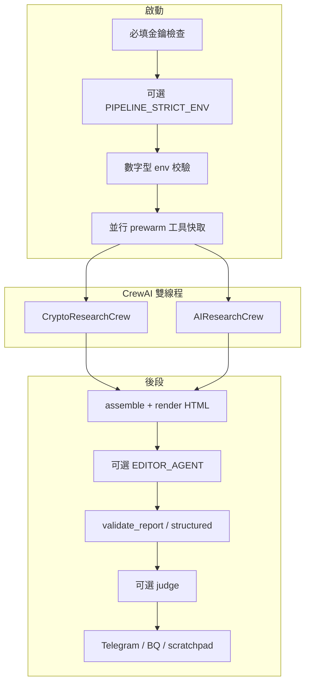

# Q-Silicon Institutional Research AI Agent

機構級 **日報管線**：**Python + CrewAI + LiteLLM** 並行產出 **加密市場** 與 **前沿 AI（含美股基本面）** 研究 → **規則 Gate** → 可選 **潤稿／LLM 評分** → **Telegram HTML**；指標與日誌寫入 **BigQuery**；**Streamlit** 與 **PWA** 呈現戰情室。

**紅線**：可驗證的價格、技術與宏觀數字須由 **工具層** 取得並注入 Context；LLM **不得捏造**客觀數據。日報主線 **不依賴 X/Twitter**（見 [`.cursorrules`](.cursorrules)）。Telegram 僅允許白名單 HTML — 見 [`docs/DAILY_BRIEF_V2.md`](docs/DAILY_BRIEF_V2.md)。

**索引**：[`TODOS.md`](TODOS.md) · [`CHANGELOG.md`](CHANGELOG.md) · [`CLAUDE.md`](CLAUDE.md) · [`AGENTS.md`](AGENTS.md) · [`ENV_TEMPLATE.txt`](ENV_TEMPLATE.txt)

---

## 新手專區

若你**第一次**接觸本專案，建議依下列順序進行，不必一次備齊所有金鑰。

### 你現在在哪一種情境？

| 我想… | 先做這件事 | 需要金鑰？ |
|--------|------------|------------|
| **看看介面長怎樣** | 跑 [Streamlit 戰情室](#快速開始) | **不需要**（BigQuery 區塊會顯示降級提示） |
| **確認程式能跑、CI 同款** | `ruff check .` 與 `pytest -m smoke`（見 [開發與測試](#開發與測試)） | **不需要** |
| **在本機乾跑一輪管線**（不推 Telegram、不寫 BQ） | `SKIP_TELEGRAM=1 SKIP_BIGQUERY=1 python main.py` | 仍須 **四個啟動必填** LLM + Apify（見 [環境變數](#環境變數)） |
| **正式產報＋推播＋寫入雲端** | 備齊 Telegram、GCP、資料源金鑰；生產建議 `PIPELINE_STRICT_ENV=1` | **是**（見 [`ENV_TEMPLATE.txt`](ENV_TEMPLATE.txt)、[`docs/DEPLOY_RUNBOOK.md`](docs/DEPLOY_RUNBOOK.md)） |

### 建議學習路徑（約 30–60 分鐘）

1. **讀專案紅線**：[`.cursorrules`](.cursorrules) 前兩節（數據來源、Telegram HTML）— 之後看 Gate 錯誤訊息會快很多。  
2. **開戰情室**：`streamlit run dashboard.py --server.port 8501 --server.headless true` — 熟悉 KPI／趨勢 Tab；契約說明見 [`docs/DASHBOARD_CONTRACT.md`](docs/DASHBOARD_CONTRACT.md)。  
3. **準備環境**：`cp ENV_TEMPLATE.txt .env`，先填 **啟動必填** 四項；其餘依你要不要 CoinGlass、新聞源等再補。  
4. **跑測試**：`python3 -m pytest -m smoke -q` — 與 PR CI 一致，通過代表核心契約未壞。  
5. **再跑 `main.py`**：第一次建議加 `SKIP_TELEGRAM=1 SKIP_BIGQUERY=1`，等 Gate／日誌都熟悉後再打開推送與 BQ。

### 常見新手問題

- **為什麼一跑就 `RuntimeError` 缺 key？**  
  啟動會檢查 `XAI_API_KEY`、`OPENAI_API_KEY`、`GEMINI_API_KEY`、`APIFY_API_TOKEN`；與是否 `SKIP_*` 無關。  
- **為什麼要跑很久（15–30+ 分鐘）？**  
  雙 Crew、多 Agent、多工具呼叫與 Gate 重試屬正常；可從 `LOG_LEVEL=DEBUG` 觀察階段。  
- **Gate 擋下來怎麼辦？**  
  看終端 `issues` 列表；可開 `GATE_FAILURE_ARTIFACTS=1` 在 `.qsilicon/last_gate_failure/` 留底。新聞則數、UTC+8、`trade_watch` 規則見 [`report_validator.py`](report_validator.py) 與 [`docs/DAILY_BRIEF_V2.md`](docs/DAILY_BRIEF_V2.md)。  
- **選幣／選股看起來每天很像？**  
  見 [`docs/PICK_ROTATION_SEMANTICS.md`](docs/PICK_ROTATION_SEMANTICS.md) 與 [`TODOS.md`](TODOS.md) 橫切說明；可選 env 加嚴輪動（`ENV_TEMPLATE.txt` 內 `PICK_ROLLING_*`、`STRICT_PICK_*`）。  
- **CoinGlass 回 401？**  
  多半是方案不含該端點，非網址拼錯；見下方 [CoinGlass API v4](#coinglass-api-v4) 與 [`AGENTS.md`](AGENTS.md)。

### 下一步讀哪裡？

| 目的 | 文件 |
|------|------|
| 日報版面與用語 | [`docs/DAILY_BRIEF_V2.md`](docs/DAILY_BRIEF_V2.md) |
| 部署與排程 | [`docs/DEPLOY_RUNBOOK.md`](docs/DEPLOY_RUNBOOK.md) |
| 開發者導覽（模組、指令） | [`CLAUDE.md`](CLAUDE.md) |
| 雲端／CoinGlass 備忘 | [`AGENTS.md`](AGENTS.md) |
| 工程待辦與路線 | [`TODOS.md`](TODOS.md)、[`docs/ROADMAP_VISION.md`](docs/ROADMAP_VISION.md) |

---

## 目次

1. [新手專區](#新手專區)  
2. [快速開始](#快速開始)  
3. [架構概覽](#架構概覽)  
4. [核心模組](#核心模組)  
5. [Agent 與模型](#agent-與模型)  
6. [環境變數](#環境變數)  
7. [驗證、Gate 與觀測](#驗證gate-與觀測)  
8. [開發與測試](#開發與測試)  
9. [目錄結構](#目錄結構)  
10. [Docker](#docker)  
11. [CI／Deploy](#cideploygithub-actions)  
12. [資料流](#資料流)  
13. [輔助腳本](#輔助腳本)  
14. [文件索引](#文件索引)  
15. [CoinGlass API v4](#coinglass-api-v4)  
16. [安全與維運](#安全與維運)  
17. [War Room PWA 與 API](#war-room-pwa-與-api)  
18. [gstack（選用）](#gstack選用)  

---

## 快速開始

```bash
pip install -r requirements.txt
cp ENV_TEMPLATE.txt .env   # 編輯填入金鑰
python main.py
```

| 情境 | 指令 |
|------|------|
| 乾跑（不推 Telegram、不寫 BQ） | `SKIP_TELEGRAM=1 SKIP_BIGQUERY=1 python main.py` |
| 生產式啟動檢查 | `PIPELINE_STRICT_ENV=1` — 未 `SKIP_*` 時強制 Telegram／GCP 憑證齊備 |
| 除錯 | `LOG_LEVEL=DEBUG CREW_VERBOSE=1 python main.py` |
| 雙軌比對 | `REPORT_COMPARE_MODE=1 python main.py` → [`docs/REPORT_COMPARE_STAGING.md`](docs/REPORT_COMPARE_STAGING.md) |

**Streamlit 戰情室**

```bash
streamlit run dashboard.py --server.port 8501 --server.headless true
```

**Python**：Dockerfile 為 3.11-slim；本機 3.12 通常可運行。專案為**根目錄扁平** Python 腳本集合，無 `pyproject.toml`。

---

## 架構概覽



---

## 核心模組

| 模組 | 職責 |
|------|------|
| [`main.py`](main.py) | 啟動檢查、prewarm、雙 Crew、`run_pipeline_with_retries`、Telegram、BQ、圖表 |
| [`crew.py`](crew.py) | 兩段 Crew、Agent/Task、LiteLLM fallback 鏈 |
| [`tools.py`](tools.py) | 搜尋、新聞、CoinGlass、鏈上、宏觀、Financial Datasets、量化等；快取與 traced 呼叫 |
| [`api_schema.py`](api_schema.py) | 工具 JSON 結構防呆 |
| [`schemas.py`](schemas.py) | `DailyBriefReport`、QSREC 等 Pydantic |
| [`report_render.py`](report_render.py) | 組裝與 Telegram HTML 渲染 |
| [`report_validator.py`](report_validator.py) | Gate：新聞、UTC+8、可選新鮮度、QSREC、輪動、一致性等 |
| [`report_editor.py`](report_editor.py) | 可選潤稿（`EDITOR_AGENT_ENABLED`） |
| [`report_judge.py`](report_judge.py) | 硬規則審核；可選 `REPORT_LLM_JUDGE` |
| [`scratchpad.py`](scratchpad.py) | Run 級 JSONL、工具上限／重複偵測 |
| [`telegram_sender.py`](telegram_sender.py) | HTML 清洗、分段推送、Gate 告警 |
| [`bigquery_writer.py`](bigquery_writer.py) | 指標、LLM run log、exclusion context、**`write_gate_failure_log`** |
| [`tracker.py`](tracker.py) | 持倉與上期建議 |
| [`signal_weights_store.py`](signal_weights_store.py) | ML 權重版本化；可選注入 context（`WEIGHTS_CONTEXT_ENABLED`） |
| [`crew_company.py`](crew_company.py) | 公司 Growth 敘事試點（`COMPANY_CREW_ENABLED`） |
| [`company_ops_schemas.py`](company_ops_schemas.py) | 公司戰情 Pydantic |
| [`dashboard.py`](dashboard.py) | Streamlit 戰情室 |
| [`api.py`](api.py) | FastAPI — PWA／戰情室資料 |
| [`monitor_intraday.py`](monitor_intraday.py) | 盤中監控（workflow 見 `.github`） |

---

## Agent 與模型

模型 ID 與表名在 [`config.py`](config.py)；覆寫見 [`ENV_TEMPLATE.txt`](ENV_TEMPLATE.txt)。兩段 Crew 皆為 **研究員 → 風險／辯論 → 策略主編**。

**CryptoResearchCrew**

| 角色 | LLM 槽 | env | API Key |
|------|--------|-----|---------|
| 加密研究員 | Grok（fallback 鏈） | `MODEL_GROK` | `XAI_API_KEY` |
| 風險審計 | Gemini | `MODEL_GEMINI` | `GEMINI_API_KEY` |
| 策略主編 | Gemini | `MODEL_GEMINI` | `GEMINI_API_KEY` |

**AIResearchCrew**

| 角色 | LLM 槽 | env | API Key |
|------|--------|-----|---------|
| AI 研究員 | Grok | `MODEL_GROK` | `XAI_API_KEY` |
| 市場辯論 | Gemini | `MODEL_GEMINI` | `GEMINI_API_KEY` |
| 策略主編 | Gemini | `MODEL_GEMINI` | `GEMINI_API_KEY` |

**備援**：`crew.py` 的 `_FALLBACK_CHAINS`；`ANTHROPIC_API_KEY` 啟用 Claude；凌晨降級可將兩槽改為 GPT（`MODEL_GPT` / `OPENAI_API_KEY`）。  
**其他呼叫**：情緒分數工具；`REPORT_LLM_JUDGE` 使用 OpenAI 等 — 見 `ENV_TEMPLATE`。  
**費用**：[`docs/COST_PER_MODEL.md`](docs/COST_PER_MODEL.md)

---

## 環境變數

### 啟動必填（缺則 `RuntimeError`）

`XAI_API_KEY`、`OPENAI_API_KEY`、`GEMINI_API_KEY`、`APIFY_API_TOKEN`。

### 選填類別（摘錄）

| 類別 | 代表變數 |
|------|-----------|
| LLM 備援 | `ANTHROPIC_API_KEY`、`OPENROUTER_API_KEY` |
| 新聞／搜尋 | `NEWSAPI_KEY`、`GNEWS_API_KEY`、`TAVILY_API_KEY` |
| 舊版 X 相關 | `TWITTER_BEARER_TOKEN` 等 — **管線主線不使用**；僅工具層遺留／手動情境 |
| 市場／鏈上 | `COINGLASS_API_KEY`、`CRYPTOPANIC_API_KEY`、`CRYPTOQUANT_API_KEY`、`FRED_API_KEY`、`GLASSNODE_API_KEY` |
| AI 基本面 | `FINANCIAL_DATASETS_API_KEY` |
| 推送／雲端 | `TELEGRAM_BOT_TOKEN`、`TELEGRAM_CHAT_ID`、`GCP_PROJECT_ID`、`GCP_SA_KEY` 或 `GOOGLE_APPLICATION_CREDENTIALS` |

**完整註解**以 [`ENV_TEMPLATE.txt`](ENV_TEMPLATE.txt) 為準。可選 **加嚴 Gate**（資料缺失計數、輪動頻率、工具證據等）見模板內 `DATA_MISSING_COUNT_GATE_MAX`、`PICK_ROLLING_*`、`STRICT_*` 註解。

### 管線、Gate、觀測（摘錄）

| 變數 | 說明 |
|------|------|
| `PIPELINE_STRICT_ENV` | `1` 時：未 skip 則硬擋 Telegram／GCP 憑證 |
| `SKIP_TELEGRAM` / `SKIP_BIGQUERY` | 乾跑常用 |
| `MAX_REPORT_RETRIES` | Gate 失敗重試（預設 2） |
| `CREW_FUTURE_TIMEOUT_SEC` | 雙 Crew 逾時（預設 2700） |
| `SCRATCHPAD_ENABLED` | JSONL 軌跡 |
| `MAX_TOOL_CALLS_PER_RUN` / `REPEATED_CALL_THRESHOLD` | 防工具跑飛 |
| `ALLOW_PARTIAL_NEWS_GATE` | 3–5 則新聞分段模式（預設開） |
| `STRICT_NEWS_FRESHNESS_GATE` / `NEWS_FRESHNESS_WINDOW_HOURS` / `NEWS_FRESHNESS_SOURCE_WHITELIST` | 可選新聞新鮮度（生產建議見 [`docs/DEPLOY_RUNBOOK.md`](docs/DEPLOY_RUNBOOK.md)） |
| `GATE_FAILURE_ARTIFACTS` | 失敗時寫 `.qsilicon/last_gate_failure/` |
| `GATE_FAILURE_BQ_LOG` | 結構化寫入 BQ `gate_failure_log`（預設開；`SKIP_BIGQUERY=1` 略過） |
| `REPORT_LLM_JUDGE` / `REPORT_LLM_JUDGE_BLOCKING` | 可選 LLM 評分 |
| `REPORT_COMPARE_MODE` | 雙軌觀測 |
| `EDITOR_AGENT_ENABLED` | 可選潤稿 |
| `WEIGHTS_CONTEXT_ENABLED` / `COMPANY_CREW_ENABLED` | 權重 context／公司敘事試點 |

啟動會列 **API key inventory**（不落密）；`VERIFY_API_KEYS=1` 可做輕量連線探測。

---

## 驗證、Gate 與觀測

| 層級 | 內容 |
|------|------|
| `validate_report` | HTML／敘事：`〔新聞 N〕`、`UTC+8`、partial news、`trade_watch` 與交易欄位放寬邊界等 |
| `validate_structured_report` | Pydantic、QSREC、`STRICT_PICK_*` 等 |
| `report_judge` | 硬 pattern；可選 LLM judge |
| 本機 artifact | `.qsilicon/last_gate_failure/`（見 `GATE_FAILURE_ARTIFACTS`） |
| BigQuery | `write_gate_failure_log` — 分類 bucket、`fingerprint`、issues 預覽等（見 `bigquery_writer.py`） |

細節以 `report_validator.py`、`main.py`、`docs/DAILY_BRIEF_V2.md` 為準。週聚合範例 SQL → [`docs/SQL/gate_failure_weekly_summary.sql`](docs/SQL/gate_failure_weekly_summary.sql)。選幣輪動語意 → [`docs/PICK_ROTATION_SEMANTICS.md`](docs/PICK_ROTATION_SEMANTICS.md)。

---

## 開發與測試

```bash
ruff check .
python3 -m pytest -m smoke -q   # 與 PR CI 對齊
python3 -m pytest -v            # 全量（root 下 test_*.py）
./scripts/bench_autoresearch.sh # ruff + smoke，尾端官方 METRIC 行（見腳本註解）
```

**習慣**：修 bug 先寫失敗測試再改到綠（見 [`CLAUDE.md`](CLAUDE.md)）。

---

## 目錄結構

```
.
├── main.py, crew.py, tools.py, config.py, schemas.py
├── report_*.py, telegram_sender.py, bigquery_writer.py, tracker.py
├── scratchpad.py, api.py, api_schema.py, dashboard.py
├── signal_weights_store.py, crew_company.py, company_ops_schemas.py
├── monitor_intraday.py, visualizer.py, backtest.py, backfill_data.py
├── core/report_validation.py
├── requirements-monitor.txt # 盤中監控 Action 專用（無 CrewAI）
├── scripts/              # bench_autoresearch.sh, write_ml_weights.py, inject_test_data.py, oss_scout_candidates.py
├── docs/                 # 規格、runbook、SQL、路線圖
├── templates/            # telegram_report.j2
├── data-verification-ui/ # Vite + React PWA
├── .github/workflows/    # ci, deploy, scheduler, monitor-intraday, weekly-scout / weekly-backtest（手動）
├── Dockerfile, docker-compose.yml
├── ENV_TEMPLATE.txt, TODOS.md, CHANGELOG.md, CLAUDE.md, AGENTS.md
└── .cursor/rules/        # Cursor 專案規則
```

---

## Docker

```bash
docker build -t q-silicon-agent .
docker run --env-file .env q-silicon-agent
```

亦可使用 `docker-compose.yml`（搭配 `--env-file .env`）。

---

## CI／Deploy（GitHub Actions）

| Workflow | 觸發 | 內容 |
|----------|------|------|
| [`ci.yml`](.github/workflows/ci.yml) | PR；`workflow_call` | PR：`ruff` + `pytest -m smoke`；被 deploy 呼叫時跑完整 `pytest -v` |
| [`deploy.yml`](.github/workflows/deploy.yml) | `push main`（paths 篩選）或手動 | CI 通過後 build／push 映像、`gcloud run jobs deploy`；`environment: production` |
| [`setup-scheduler.yml`](.github/workflows/setup-scheduler.yml) | 手動 | Cloud Scheduler |
| [`monitor-intraday.yml`](.github/workflows/monitor-intraday.yml) | cron（預設每 **2** 小時）／手動 | 盤中 BTC／VIX；依賴 [`requirements-monitor.txt`](requirements-monitor.txt)（**非**全量 `requirements.txt`，省 Actions 分鐘） |
| [`weekly-scout.yml`](.github/workflows/weekly-scout.yml) | 手動 | OSS 候選腳本（輔助；見 `scripts/oss_scout_candidates.py`） |
| [`weekly-backtest.yml`](.github/workflows/weekly-backtest.yml) | 手動 | `backtest.py --optimize --write-signal-weights`（需 repository secret `GCP_SA_KEY`） |

**GitHub Actions 免費額度／磁碟**：排程 workflow 若每次 `pip install` 全量依賴會耗分鐘；盤中監控已改輕量依賴 + 較低頻率。若出現 **`No space left on device`**（含 runner 無法寫 `_diag` log），workflow 已內建 **釋放預裝 SDK 磁碟** 與 **`pip install --no-cache-dir`**；**自架 runner** 仍須在本機擴充分區或清快取。

生產人工閘門與 secrets 配置 → [`docs/DEPLOY_RUNBOOK.md`](docs/DEPLOY_RUNBOOK.md)。Cloud Run 為 **Job**（排程／手動），非長駐 HTTP。

---

## 資料流

```
BQ 昨日摘要 / 上期 QSREC（+ 可選權重／公司敘事 context）
        ↓
雙 Crew 並行 → Pydantic 區塊
        ↓
assemble → render → [可選 editor] → validate → [judge]
        ↓
Telegram（HTML）· BQ metrics · gate_failure_log · scratchpad
        ↓
Streamlit / PWA / api.py
```

---

## 輔助腳本

| 路徑 | 說明 |
|------|------|
| [`scripts/bench_autoresearch.sh`](scripts/bench_autoresearch.sh) | Lint + smoke + `METRIC` 輸出 |
| [`scripts/write_ml_weights.py`](scripts/write_ml_weights.py) | ML 權重寫入 store |
| [`scripts/inject_test_data.py`](scripts/inject_test_data.py) | BQ 測試資料 |
| [`scripts/oss_scout_candidates.py`](scripts/oss_scout_candidates.py) | GitHub Search 候選（Scout 輔助） |
| `python backtest.py` | 回測（BQ + CoinGecko）；可 `--write-signal-weights` 寫入權重 store |
| `python backfill_data.py` | 歷史指標回填 BQ |

---

## 文件索引

| 類型 | 文件 |
|------|------|
| 工程狀態 | [`TODOS.md`](TODOS.md)、[`CHANGELOG.md`](CHANGELOG.md) |
| 開發導覽 | [`CLAUDE.md`](CLAUDE.md)、[`AGENTS.md`](AGENTS.md) |
| 日報規格 | [`docs/DAILY_BRIEF_V2.md`](docs/DAILY_BRIEF_V2.md) |
| 儀表／API 契約 | [`docs/DASHBOARD_CONTRACT.md`](docs/DASHBOARD_CONTRACT.md) |
| 部署 | [`docs/DEPLOY_RUNBOOK.md`](docs/DEPLOY_RUNBOOK.md) |
| Critical env／加嚴 Gate | [`docs/CRITICAL_ENV_POLICY.md`](docs/CRITICAL_ENV_POLICY.md) |
| 選幣輪動語意 | [`docs/PICK_ROTATION_SEMANTICS.md`](docs/PICK_ROTATION_SEMANTICS.md) |
| 長期路線備忘（1B／2B／Company） | [`docs/PHASE_F_BACKLOG.md`](docs/PHASE_F_BACKLOG.md) |
| 路線／商業化 | [`docs/ROADMAP_VISION.md`](docs/ROADMAP_VISION.md)、[`docs/COMMERCE_PLAYBOOK.md`](docs/COMMERCE_PLAYBOOK.md)、[`docs/COMMERCE_NEXT_STEPS.md`](docs/COMMERCE_NEXT_STEPS.md) |
| Autoresearch | [`docs/AUTORESEARCH_LOOP.md`](docs/AUTORESEARCH_LOOP.md)、[`docs/autoresearch.plan.md`](docs/autoresearch.plan.md) |
| 工具拆分計畫 | [`docs/TOOLS_MODULARIZATION_PLAN.md`](docs/TOOLS_MODULARIZATION_PLAN.md) |
| 公司 Crew 路線 | [`docs/COMPANY_CREW_ROADMAP.md`](docs/COMPANY_CREW_ROADMAP.md) |
| 其他 | [`docs/COST_PER_MODEL.md`](docs/COST_PER_MODEL.md)、[`docs/REPORT_COMPARE_STAGING.md`](docs/REPORT_COMPARE_STAGING.md)、[`docs/oss_candidates/README.md`](docs/oss_candidates/README.md)、[`docs/MCP_ASK_USER_QUESTION.md`](docs/MCP_ASK_USER_QUESTION.md)、[`docs/ADOPTION_DEXTER_CONCEPTS.md`](docs/ADOPTION_DEXTER_CONCEPTS.md) |

---

## CoinGlass API v4

- Base：`https://open-api-v4.coinglass.com`；Header：`CG-API-KEY`
- 成功：`code` 為 `"0"` 或 `0`；`401` / `Upgrade plan` 多為訂閱不含該端點
- 部分指標有 **Binance 公開 API 備援**（`tools.py`）

本機 `curl` 自測須在**已載入金鑰的同一 shell**（範例見 [`AGENTS.md`](AGENTS.md)）。

---

## 安全與維運

- 金鑰僅經環境變數或 Secret Manager；`.env`、服務帳戶 JSON 勿提交（`.gitignore`）。
- Telegram 僅允許白名單標籤（`sanitize_telegram_html`）。
- Actions 建議 pinned 版本；容器建議非 root。

---

## War Room PWA 與 API

```
FastAPI (api.py)  ←→  BigQuery
        ↓
React PWA (data-verification-ui/)
```

**本機**：`uvicorn api:app --reload --port 8000`；前端 `cd data-verification-ui && npm install && npm run dev`（預設 proxy `/api` → `:8000`）。無 BQ 時 API 可能錯誤，UI 仍可開發。

**端點與 KPI 對齊** → [`docs/DASHBOARD_CONTRACT.md`](docs/DASHBOARD_CONTRACT.md)（含 `/api/metrics/latest`、`/api/reports/...`、`/healthz` 等）。

**生產**：`npm run build` 產 `dist/`；搭配 `CORS_ORIGINS`、`GCP_PROJECT_ID` 等。PWA 安裝：iOS「加入主畫面」、Android「安裝應用程式」。

---

## gstack（選用）

瀏覽器 QA、review、ship 等流程技能 — 見 [`AGENTS.md`](AGENTS.md)、[`gstack.md`](gstack.md)（若存在）。
