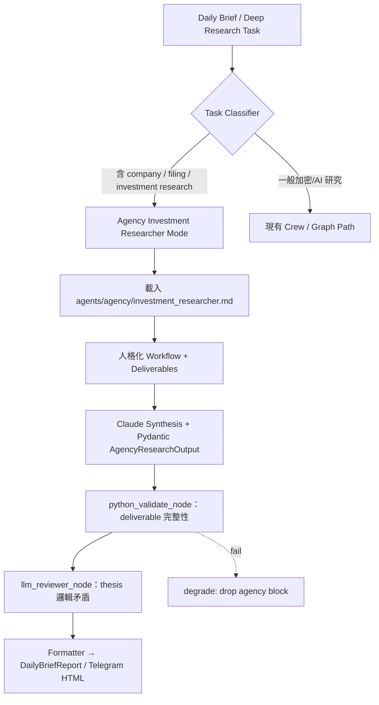

# Agency Agents Research & Integration Plan

**版本：** 1.0 (2026-04-20)
**狀態：** 規劃階段 → 待實作
**相鄰文件：** [`AI_CONTEXT.md`](AI_CONTEXT.md)、[`REVIEWER_LOOP_DESIGN.md`](REVIEWER_LOOP_DESIGN.md)、[`notebooklm_research.md`](notebooklm_research.md)、[`TERMINAL_FRONTEND_PLAN.md`](TERMINAL_FRONTEND_PLAN.md)

---

## 1. 研究背景與動機

GitHub 專案：<https://github.com/msitarzewski/agency-agents>
**83.8k stars / 13.4k forks**（MIT License，可商業使用）
最後更新：近期活躍（291 commits），144 個專精 AI Agent 定義（全 Markdown 格式）。

**核心功能**：
「The Agency」是一個完整的 AI 代理夢幻團隊，提供 144 個**人格化、生產就緒**的專精 Agent，涵蓋 12 個 Division（Engineering、Design、Finance、Marketing、Product、Project Management 等）。每個 Agent 包含：
- 獨特人格與溝通風格
- Core Mission + Critical Rules
- Technical Deliverables（含真實程式碼範例）
- Step-by-step Workflow
- Success Metrics（可量化）

**Finance Division 亮點（與本 repo 高度重合）**：
- Investment Researcher（盡職調查、資產估值、股權研究、thesis 開發）
- Financial Analyst（建模、預測、variance analysis）
- FP&A Analyst、Tax Strategist、Bookkeeper & Controller

**與 Q-Silicon Institutional Research AI Agent 的契合度**：
- 本 repo 核心是 CrewAI + LangGraph 雙軌引擎，專注**每日投資日報 + no-hallucination deep research**（招股書、趨勢、加密/AI 美股）。
- 目前 `crew.py` 的 `backstory` 欄位只有 1–2 行簡短描述，缺少人格化、結構化 workflow 與可量化 deliverable。
- Agency Agents 正好提供**現成、可直接轉換**的 Finance/Research 專精模板，可大幅強化 Claude Code / Cursor 開發體驗與日報品質。
- 無需重寫框架，直接把 Investment Researcher 的 workflow 注入 `crew.py` 的 `backstory` 或 `graph/graph_nodes.py` 的 `deep_research_node`，讓 agent 擁有「機構級研究人格」。

---

## 2. 研究目標

### Primary

1. 將 Agency 的 **Finance Division Agents**（尤其是 Investment Researcher）轉換成可重用 prompt template，無縫嵌入 `graph/graph_nodes.py` 與 `CLAUDE.md`。
2. 讓 `daily_brief_crew` / `deep_research_node` 在處理公司盡調、財報、打新股時自動呼叫「Investment Researcher 模式」，輸出結構化 deliverable。
3. 擴充 `brief_profiles.py` 新增 `agency_finance_block`，讓 full profile 自動包含人格化研究區塊。
4. 維持 repo 現有 **Pydantic validation gates** 與 **citation 強制**（Agency 強調 evidence-based，完美契合 no-hallucination）。

### Secondary

- 把全部 144 個 Agent 轉為 `agents/agency/` 目錄下的模板庫，支援多 Agent 協作（Agents Orchestrator 概念）。
- 利用其 workflow 強化 `report_quality_agent` 的審核標準。
- 與 NotebookLM + TrendRadar 串聯，形成「TrendRadar 抓熱點 → Agency Investment Researcher 深挖 → NotebookLM 驗證 filing」的完整研究 pipeline（見 §5.4）。

---

## 3. 範圍與限制

**納入範圍**：

- 新增 `agents/agency/` 目錄，存放轉換後的 `.md` templates（重點先做 Investment Researcher + Financial Analyst）
- `graph/graph_nodes.py` 新增 `agency_researcher_node` 條件觸發
- `crew.py` 的 `backstory` 欄位升級為 Agency template 注入點
- `CLAUDE.md` 補充「Agency Agents 整合指引」與 prompt 範例
- `schemas.py` 擴充 `AgencyResearchOutput` model（含 deliverables、metrics、citations）
- 更新 `AGENTS.md`、`brief_profiles.py` 與 README Roadmap

**排除範圍（Phase 2）**：

- 完整 fork + 修改原始 scripts/install.sh
- 所有 144 個 Agent 一次導入（先聚焦 Finance Division）
- 前端工具整合（Cursor / Claude Code 自動 install）

---

## 4. 技術架構



**兩條注入路徑**：

1. **CrewAI 路徑**（`crew.py`）：在 Agent 的 `backstory` 欄位載入對應 Agency template 的 Core Mission + Critical Rules。`goal` 欄對應 deliverables。影響範圍：`CryptoResearchCrew` / `AIResearchCrew` 的所有 agent。

2. **LangGraph 路徑**（`graph/graph_nodes.py`）：新增 `agency_researcher_node`，在 `deep_research_node` 條件觸發後，以 Agency workflow 取代目前單一 LLM 呼叫，輸出 `AgencyResearchOutput`。

---

## 5. Q-Silicon Integration Notes

本節為對 Agency Agents 的在地化調整，與既有架構緊耦合。

### 5.1 crew.py 注入點分析

目前 [`crew.py`](../../crew.py) 的 agent 定義風格：

```python
# 現況：backstory 只有 1–2 行
role="機構策略主編（加密市場）",
goal="整合研究成果，輸出戰報上半部。",
backstory="最終排版與風控守門員；嚴守【思考區／展示區】與【機構級寫作】Bloomberg 式洗練。",
```

升級目標：把 Agency Investment Researcher 的 Core Mission + Critical Rules 展開至 `backstory`：

```python
# 升級後：backstory 從 Agency template 動態載入
_IR_TEMPLATE = _load_agency_template("investment_researcher")

role="機構策略主編（加密市場）",
goal="整合研究成果，輸出戰報上半部；deliverables: thesis, valuation_range, risk_register",
backstory=_IR_TEMPLATE.core_mission + "\n\nCritical Rules:\n" + _IR_TEMPLATE.critical_rules,
```

`_load_agency_template()` 是個純 Python helper，從 `agents/agency/*.md` 讀取並解析成 dataclass。無外部依賴，fallback 到原 hardcoded backstory。

### 5.2 graph_nodes.py：agency_researcher_node

觸發條件：task 包含 company / equity / 盡調 / IPO / earnings 等關鍵字（與 notebooklm_research.md §8.2 的 `FILING_KEYWORDS` 可共用同一個 `TaskClassifier`）：

```python
AGENCY_RESEARCH_KEYWORDS = re.compile(
    r"盡調|盡職調查|equity|earnings|IPO|打新|S-1|annual report|10-K"
    r"|investment thesis|valuation|公司研究",
    re.IGNORECASE,
)

def needs_agency_researcher(state: ResearchGraphState) -> bool:
    if not os.getenv("AGENCY_RESEARCH_ENABLED", "0") == "1":
        return False
    return bool(AGENCY_RESEARCH_KEYWORDS.search(state.get("user_question", "")))
```

`agency_researcher_node` 邏輯：
1. 載入 `agents/agency/investment_researcher.md`
2. 以 Agency workflow（盡調 → 建模 → thesis → risk register → deliverable 格式化）取代 `_deep_research_with_bound_tools` 的單次 LLM call
3. 輸出 `AgencyResearchOutput`（含 thesis、valuation_range、risk_register、citations）

### 5.3 Pydantic Schema

新增至 `schemas.py`：

```python
class AgencyDeliverable(BaseModel):
    name: str                    # e.g. "investment_thesis", "valuation_model"
    content: str
    confidence: Literal["high", "medium", "low"]
    citations: list[str]         # 與 DeepFilingAnalysis.Citation 平行

class AgencyResearchOutput(BaseModel):
    agent_type: Literal["investment_researcher", "financial_analyst", "fp_and_a"]
    ticker: str | None = None
    deliverables: list[AgencyDeliverable]
    risk_register: list[str]
    success_metrics: dict[str, str]   # metric_name → status
    generated_at: datetime
```

`python_validate_node` 擴充第 8 條：`agency_research_output` 存在時，每個 `deliverable.citations` 至少 1 條且非空；`risk_register` 至少 2 條。

### 5.4 三層 Pipeline：TrendRadar → Agency → NotebookLM

此為 Secondary 目標，但值得在架構層面先規劃好接口：

```
TrendRadar（熱點偵測） 
    → Agency Investment Researcher（結構化 thesis + risk register）
        → NotebookLM（filing 驗證 + 引用取證）
            → python_validate_node（citation + deliverable 完整性）
                → DailyBriefReport
```

三者分工：
- **TrendRadar**：「這個方向值得挖」（信號）
- **Agency Researcher**：「按機構級 workflow 深挖、建 thesis」（框架）
- **NotebookLM**：「每個數字都有 filing 原文為證」（事實）

[`notebooklm_research.md`](notebooklm_research.md) §6.2 的 8 問殺手問題即是 Agency Investment Researcher 的 deliverable 子集，兩者可共用同一個 `AgencyResearchOutput.deliverables`，避免重複建模。

### 5.5 agents/agency/ 目錄結構

```
agents/
└── agency/
    ├── __init__.py            # _load_agency_template() helper
    ├── investment_researcher.md
    ├── financial_analyst.md
    ├── fp_and_a_analyst.md
    └── README.md              # 轉換規範 + upstream sync 說明
```

轉換規範：保留原始 Agent 的 Core Mission、Critical Rules、Deliverables、Workflow、Success Metrics；移除 upstream 的 UI/設定細節；加入 Q-Silicon 紅線（no-hallucination、Telegram HTML whitelist、`[DATA_MISSING:*]` sentinel）。

### 5.6 Feature Flag

| Env | 預設 | 意義 |
|---|---|---|
| `AGENCY_RESEARCH_ENABLED` | `0` | 主開關；staging 驗收前 prod 關閉 |
| `AGENCY_TEMPLATE_DIR` | `agents/agency/` | 模板目錄；可 override 指向自訂路徑 |
| `AGENCY_FALLBACK_TO_DEFAULT` | `1` | 模板載入失敗時 fallback 到原 backstory |

---

## 6. Investment Researcher Agent 模板草案

以下為從 Agency Agents 轉換後、符合 Q-Silicon 風格的 template 骨架。Phase 1 以此為基礎寫入 `agents/agency/investment_researcher.md`：

```markdown
# Investment Researcher — Q-Silicon Edition

## Core Mission
你是 Q-Silicon 的機構級投資研究員。你的工作是對上市公司、IPO 標的、加密資產進行
全面盡職調查，產出帶引用的結構化研究報告。你不猜測、不外推——任何數字都需要
有數據來源，否則以 [DATA_MISSING:*] 標示。

## Critical Rules
1. **No data hallucination**：財務數據（EPS、PE、毛利率、市值）必須來自 Python tools 
   或 NotebookLM filing 驗證，不得 LLM 自填。
2. **Evidence-first thesis**：每個 investment thesis bullet 必須附 ≥ 1 條數據引用。
3. **Risk register 強制**：每次輸出至少 3 條 bear case / red flags。
4. **Telegram whitelist**：輸出至 HTML 時只用 <b>、<i>、<code>、<blockquote>。
5. **Degrade gracefully**：任一 deliverable 缺乏引用 → 整區塊標 confidence=low，
   不進最終 Telegram 輸出。

## Deliverables
1. **investment_thesis**：3–5 bullet，每條帶數據引用
2. **valuation_summary**：目標區間 + 方法（DCF / comps / EV/EBITDA）
3. **risk_register**：3–5 條 bear case，分 company-specific / macro
4. **catalyst_calendar**：未來 3–6 個月近端事件（財報日、Lock-up 到期、法規審批）
5. **comparable_analysis**：2–3 家同行對比（毛利率、P/S、增速）

## Workflow
① 確認研究標的（ticker / filing type / 研究方向）
② 呼叫 Python market tools 取得基礎財務指標
③ 如有 filing（招股書/10-K/S-1）→ 呼叫 NotebookLM 8 問驗證
④ 建 investment thesis（bull + bear）
⑤ 引用數字回溯至數據來源，標注 confidence
⑥ 輸出 AgencyResearchOutput Pydantic model

## Success Metrics
- deliverables 中 citations 覆蓋率 100%
- risk_register ≥ 3 條
- confidence=high 比例 ≥ 60%（月度復盤）
- 通過 python_validate_node 第 8 條檢查
```

---

## 7. 實施階段與時間表

| 階段 | 內容 | 預計完成 |
|------|------|----------|
| Phase 0 | 本文件 + fork agency-agents repo + 閱讀 Finance Division 原始 agent 定義 | 2026-04-21 |
| Phase 1 | 建 `agents/agency/` 目錄 + `investment_researcher.md` + `_load_agency_template()` helper | 2026-04-23 |
| Phase 2 | `crew.py` backstory 升級（3 個 agent 先試：幣圈研究員、AI 研究員、主編） | 2026-04-25 |
| Phase 3 | `graph/graph_nodes.py` `agency_researcher_node` + `AgencyResearchOutput` schema + `python_validate_node` 第 8 條 | 2026-04-28 |
| Phase 4 | `brief_profiles.py` `agency_finance_block` + templates macro + `CLAUDE.md` 指引更新 | 2026-04-30 |
| Phase 5 | Financial Analyst template + 三層 pipeline（TrendRadar → Agency → NotebookLM）POC | 2026-05-07 |
| Phase 6 | Production 監控 + confidence 覆蓋率月度復盤 | 2026-05-14 起 |

**依賴**：Phase 3 需要 NotebookLM integration（[`notebooklm_research.md`](notebooklm_research.md)）Phase 1 先落地，確保 citation 驗證路徑可用。

---

## 8. 成功指標（KPI）

| KPI | 目標 |
|---|---|
| `deliverables` citation 覆蓋率 | 100% |
| `risk_register` 條數 | ≥ 3 條/次 |
| `confidence=high` deliverable 比例 | ≥ 60%（月度復盤） |
| `python_validate_node` 第 8 條通過率 | ≥ 95% |
| crew.py backstory 升級後日報 quality score | 月環比上升（`report_quality_agent` 評分） |
| `agency_researcher_node` 觸發後研究深度 | 比 `deep_research_node` 基線提升可量化指標 |

---

## 9. 測試策略

- **單元**：`test_load_agency_template.py` 測 markdown parsing 與 fallback；`test_agency_schema.py` 測 `AgencyResearchOutput` Pydantic 邊界（citation 空、risk_register 少於 2 條）。
- **整合**：`test_agency_researcher_node.py` 跑 fake state 走完 `agency_researcher → python_validate → reviewer`，覆蓋 happy / degrade / fallback 三路徑。
- **diff 測試**：升級 `crew.py` backstory 後，跑 `REPORT_COMPARE_MODE=1` 對比日報品質 diff（見 [`REPORT_COMPARE_STAGING.md`](../REPORT_COMPARE_STAGING.md)）。
- **Smoke**：`pytest -m smoke` 必須 green（`AGENCY_RESEARCH_ENABLED=0` 路徑不觸發，fallback 保持原 backstory）。

---

## 10. 關聯文件

- [`AI_CONTEXT.md`](AI_CONTEXT.md) — 加一行「company/equity 研究走 Agency Investment Researcher 模式」
- [`REVIEWER_LOOP_DESIGN.md`](REVIEWER_LOOP_DESIGN.md) — `python_validate_node` 第 8 條（deliverable citation 檢查）
- [`notebooklm_research.md`](notebooklm_research.md) — 三層 pipeline 下游：filing 驗證由 NotebookLM 負責
- [`modularization_plan.md`](modularization_plan.md) — `agency_finance_block` 新增流程
- [`REPORT_COMPARE_STAGING.md`](../REPORT_COMPARE_STAGING.md) — backstory 升級前後品質對比方法
- [`CLAUDE.md`](../../CLAUDE.md) §3 架構概覽、§8 命名慣例

---

## 11. 風險與緩解

| 風險 | 緩解 |
|---|---|
| Agency template 太長 → backstory 超出 LLM context | 只注入 Core Mission + Critical Rules（~300 tokens）；Deliverables + Workflow 摺疊為 goal 欄位 |
| upstream Agency repo 大改 → template 失同步 | `AGENCY_FALLBACK_TO_DEFAULT=1`；quarterly sync check；Phase 5 寫自動 diff 腳本 |
| `_load_agency_template()` 讀檔失敗（CI 環境無 agents/ 目錄） | fallback 到原 hardcoded backstory；Smoke test 在 `AGENCY_RESEARCH_ENABLED=0` 下跑，不需 agents/ 目錄 |
| 人格化 backstory 讓 agent 偏離 no-hallucination 紅線 | Agency template 的 Critical Rules 第一條就是 no data hallucination；`python_validate_node` 硬性守門 |
| 三層 pipeline latency 過高（Agency + NotebookLM 串聯） | 兩者 flag 獨立控制（`AGENCY_RESEARCH_ENABLED` / `NOTEBOOKLM_ENABLED`）；可只開其中一層；deep research 本非即時路徑 |
| Finance 以外的 144 Agent 注入混亂 | Phase 1 嚴格限定 Finance Division；其他 Agent 待 Phase 2 評估後再 opt-in |

---

## 12. 下一步

1. Clone agency-agents repo，讀完 Finance Division 全部 agent 定義（重點：Investment Researcher、Financial Analyst）。
2. 建 `agents/agency/` 目錄，寫 `__init__.py` 的 `_load_agency_template()` helper。
3. 轉換第一個 template：`agents/agency/investment_researcher.md`（參考 §6 草案）。
4. 在 staging 環境跑 `REPORT_COMPARE_MODE=1`，驗收 backstory 升級的品質 diff。
5. 開 PR，更新 [`README.md`](../../README.md) Roadmap 段。

---

**版本歷史**

| 版本 | 日期 | 變更 |
|---|---|---|
| 1.0 | 2026-04-20 | 初版，融合 Agency Agents 工作流與 Q-Silicon 既有架構（crew.py 注入點、graph_nodes 觸發條件、三層 pipeline、Pydantic schema、紅線對齊） |
