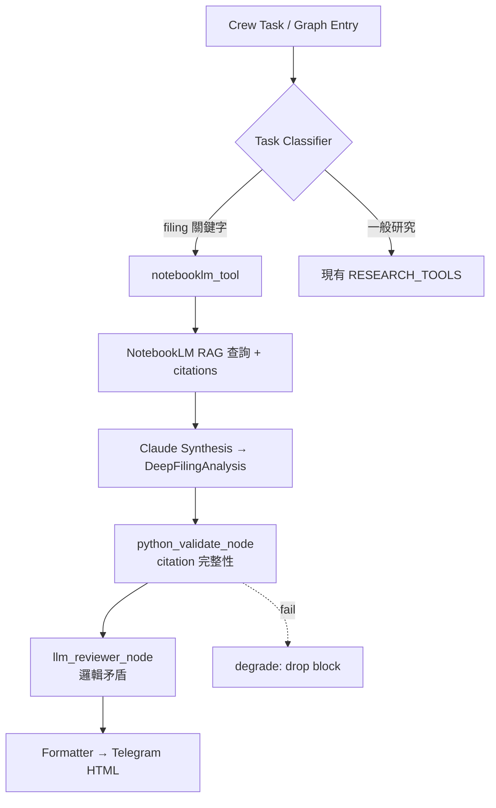

# NotebookLM Research & Integration Plan

**版本：** 1.1 (2026-04-20)
**狀態：** 規劃階段 → 待實作
**相鄰文件：** [`AI_CONTEXT.md`](AI_CONTEXT.md)、[`REVIEWER_LOOP_DESIGN.md`](REVIEWER_LOOP_DESIGN.md)、[`TERMINAL_FRONTEND_PLAN.md`](TERMINAL_FRONTEND_PLAN.md)

---

## 1. 研究背景與動機

@MinLiBuilds 2026-04-19 長文（<https://x.com/MinLiBuilds/status/2046002143937941988>）提出「NotebookLM 當老師 + Claude 當助手」的工作流，解決高密度財務文件（招股書、聆訊後資料集、10-K、S-1、基石投資者表、保薦人研報）的 token 爆炸與幻覺問題。

**核心洞見**：

- 直接把 300–600 頁 PDF 餵給 Claude → 50 萬+ token，成本高、幻覺風險高。
- 讓 **NotebookLM** 先做 RAG（只讀不幻覺、強制引用出處），再讓 Claude 負責 synthesis、表格、風險判斷、Pydantic 輸出。
- 實測：47 篇論文（≈ 50 萬 token 語料），5 輪深度問答，Claude Opus 4.7：

  | 做法 | 貴價 token 成本（5 輪） | 倍差 |
  |---|---|---|
  | **本文做法**（NotebookLM RAG） | **$0.55**（~$0.11/輪） | 1× |
  | 傳統做法，同 session cache 複用 | $9.59 | 17× |
  | 傳統做法，跨 session（cache 失效） | $47+ | 86× |

**為什麼 Prompt Cache 幫不了你**

很多人以為開了 cache 就萬事大吉。實際上 Anthropic prompt cache 預設只存 **1 小時**，研究場景偏偏是「問一下、想一會、再問一下」的節奏：切個 tab、思考停頓、開新 session——上一輪 cache 就失效，下一次調用重走 `cache_creation`（貴價）。就好比每次問律師問題，都讓他把 50 頁合約先朗讀一遍再開口。

本文做法裡論文原文壓根不進 Claude，cache 命不命中都無所謂。語料翻倍，本文做法成本基本不變；傳統做法則線性上漲。

**誰不需要這套**：

- 語料 < 5k tokens、只查一兩次 → 直接問 Claude
- 純 Q&A、不嵌工作流 → 打開 NotebookLM 網頁用就夠
- 在乎每秒響應超過每月賬單 → NotebookLM chat 慢 3 倍（中位 ~45s）
- 要理解代碼結構 / 跳定義 → 不是 NotebookLM 的長處

與本 repo **Q-Silicon AI Agent** 的目標對齊：

- 既有架構：CrewAI + LangGraph 雙軌、嚴格 no-hallucination gates、BigQuery logging。
- 現狀痛點：[`graph/graph_nodes.py`](../../graph/graph_nodes.py) 的 `deep_research_node` 仍仰賴 web tools，遇到大型非結構化 filing 時 token 成本與準確度都吃緊。
- 整合後：agent 真正具備「機構級招股書盡調」能力，成為打新股／公司深度研究的核心引擎。

---

## 2. 研究目標

### Primary

1. 將 NotebookLM 封裝為可重用 Tool，接入 [`tools/`](../../tools/) 包（遵循 [`ADR_OFFICE_HOURS_TOOLS_PLATFORM.md`](../ADR_OFFICE_HOURS_TOOLS_PLATFORM.md) 的 `BaseTool` 雛形）。
2. `deep_research_node` 在偵測「filing / prospectus / 招股書 / 10-K / S-1」關鍵字時，條件切換至 NotebookLM + Claude 模式。
3. 維持既有 **Pydantic validation gates**、**citation 強制要求**、**`report_quality_agent`** 雙重審核。
4. 單家新股深挖時間 ~4 小時 → ~20 分鐘；Claude token 成本下降 10–20×。

### Secondary

- 未來將歷史日報、[`earnings_watchlist.py`](../../earnings_watchlist.py)、[`tracker.py`](../../tracker.py) 輸出灌入 NotebookLM，成為長期個人知識庫。
- 產出可嵌入 `DailyBriefReport` / `QSREC` 的結構化 `deep_filing_analysis` 區塊（Phase 1 流 [`brief_profiles.py`](../../brief_profiles.py)）。

---

## 3. 範圍與限制

**納入**：

- `tools/notebooklm_tool.py`（基於社群 `notebooklm-client`；**可替代**：見 §11 風險）
- `graph/graph_nodes.py` 條件觸發 + 新增 `deep_filing_analysis_node`
- 固定 8 個殺手問題 prompt template + Pydantic schema
- `schemas.py` 新增 `DeepFilingAnalysis`（`citations: list[Citation]`）
- `brief_profiles.py` 新增 `deep_filing_block`（Phase 1 macro 位於 [`templates/blocks/`](../../templates/blocks/)）
- BQ `notebooklm_cost_log`（對齊 `llm_run_log` 樣式，含 `profile` 欄）
- [`CLAUDE.md`](../../CLAUDE.md) / [`AGENTS.md`](../../AGENTS.md) 開發指引
- Cache + error handling + rate-limit

**排除（Phase 2）**：

- 多 Notebook 並行管理 UI（走 [`TERMINAL_FRONTEND_PLAN.md`](TERMINAL_FRONTEND_PLAN.md) 的 investment-analysis 模組）
- 自動 PDF → Notebook 建立 pipeline（先手動上傳）
- 個人知識庫全量注入

---

## 4. 安裝快速入門

> **注意**：`notebooklm-client` 是社群套件，逆向 NotebookLM 內部協議，非 Google 官方。詳見 §11 風險。

```bash
# 安裝 client
npm i notebooklm-client

# 導出 Google 登入 session（會開瀏覽器讓你登 Google）
npx notebooklm export-session
# → 在本地生成 storage_state.json，保管好，這是你的 Google 活 session

# 測試對話
npx notebooklm chat <notebook-id> --transport auto --question "幫我總結一下"

# 安裝 Claude Code skill（安裝後可用 /notecraft 命令）
npx notebooklm skill install
```

安裝後在 Claude Code 對話裡說「查一下那個 notebook 裡 X 的部分」，Claude 會自動調 `/notecraft chat`，不用每次解釋語法。

---

## 5. 技術架構



- **Tool 設計**：實作 `tools.base.BaseTool` 介面，支援 `_get_cache` / `_set_cache`（與 [`tools_legacy.py`](../../tools_legacy.py) 慣例一致）；所有呼叫回傳 `{"answer": ..., "citations": [...]}` 或 `[DATA_MISSING:notebooklm_rate_limited]` 哨兵字串（見 [`CLAUDE.md`](../../CLAUDE.md) §8）。
- **Prompt**：固定 8 個殺手問題，每題強制 `citation: page/section`。缺 citation → 該題結果丟棄、不進 Claude synthesis。
- **Schema**：
  ```python
  class Citation(BaseModel):
      page: int | str
      section: str | None = None
      excerpt: str  # ≤ 200 chars

  class DeepFilingAnalysis(BaseModel):
      ticker: str
      filing_type: Literal["prospectus", "10-K", "10-Q", "S-1", "HKEX-post-hearing"]
      answers: dict[int, str]  # 1..8 → answer text
      citations: dict[int, list[Citation]]  # 每題至少 1
      red_flags: list[str]
      generated_at: datetime
  ```

### 8 個殺手問題（對應 NotebookLM）

1. 核心業務 + 近 3 年收入結構變化？
2. 與同行毛利率／增速／研發占比差異？
3. 基石投資者 + 鎖定期？
4. 募資用途拆分 + 控股股東稀釋？
5. 風險因素：行業共性 vs 公司特有紅旗？
6. 過往融資估值跳漲倍數？
7. 是否有一次性收益灌水？現金流 vs 淨利匹配度？
8. 關聯交易 + 前五大客戶是否為關聯方？

---

## 6. 三大工作流使用場景

本節把原文三個案例具體化，明確「語料配方」和「殺手問題」，供 Claude Code agent 模板直接使用。

### 6.1 學者 / 學生工作流

**場景**：reading list 20–50 篇論文，同一批 PDF 要反覆查幾十次。以往 Ctrl-F 翻到眼花，問 Claude 怕幻覺不帶引用。

**語料配方（灌一次用一學期）**：

- 課題相關論文 PDF 全量（20–50 篇）
- 課程大綱、講座字幕
- 導師郵件、章節草稿、讀書筆記

**殺手問題**：

- 「哪兩篇結論互相衝突，衝突在哪一層假設？」
- 「X 方法在這個語料裡出現過幾次，各自怎麼用的？」
- 「A 論文的公式 3 和 B 論文的公式 7 實際等價嗎？」

**Claude 在鏈路裡干嘛**：按課題推進——問老師拿概念/公式 → 寫代碼復現 → 跑實驗 → 整理筆記。論文原文一次都不進 Claude 會話。

---

### 6.2 打新股 / 讀招股書工作流

**場景**：港股 / A 股 / 美股 S-1 打新，窗口只有 72 小時。一本招股書 300–600 頁靠人讀完來不及，一週 5–8 家更不用說。

**語料配方（一家公司一個 notebook）**：

- 招股書全本（聆訊後資料集 / 招股意向書）—— 必灌
- 基石投資者披露表（看誰背書、鎖定期多久）
- 同行可比公司最新財報（估值對標的錨）
- 保薦人 / 承銷商研報（能搞到的話）
- 管理層過往訪談、歷史融資輪估值表
- 行業監管政策文件（決定行業天花板的外部變量）

**殺手問題**：§5 的 8 個固定問題（核心業務、同行對比、基石投資、募資用途、風險因素、歷史估值、財務調整、關聯交易）。每個都帶 `[頁碼]` 引用，點回原文不用再翻 PDF。

**批處理流程**（這是工作流的靈魂）：

```python
# 一週打新池 = [新股A, 新股B, 新股C, ...]
# Claude 逐家調 /notecraft，最後彙整成 markdown 決策表
# 你 15 分鐘掃完下單

week_ipo_pool = ["公司A", "公司B", "公司C", "公司D", "公司E"]
for ticker in week_ipo_pool:
    analysis = notebooklm_tool.query(notebook_id=ticker_to_notebook[ticker],
                                      questions=EIGHT_KILLER_QUESTIONS)
    results[ticker] = deep_filing_analysis(analysis)

summary_table = format_decision_table(results)  # → markdown, 一行一家
```

**實測成本**：5 家招股書各 150–250k token，傳統做法一週燒 $50+；本文做法 **$2 以內**。

**增量價值**：
- 壓縮決策時長：4 小時/家 → 20 分鐘/家
- 紅旗不會漏：問題 5（風險因素）、7（財務調整）、8（關聯交易）是散戶最容易忽略的
- 跨家對比：同一週同行業 3 家用同一套模板跑完直接排序

---

### 6.3 個人知識庫工作流

**場景**：Obsidian 搜索只認關鍵詞，答不出「我對 X 的看法這三年變過沒」。筆記是自己寫的，合規上沒顧慮，但體量散、格式雜，本地沒工具能跨文件做語義檢索。

**語料配方（一股腦全灌，之後增量補）**：

- Obsidian / Notion 全量導出
- Kindle 高亮、Readwise 剪藏
- 工作日記、會議紀要、復盤文件

**殺手問題**：

- 「我這三年對『專注力』寫過什麼？觀點變了嗎？」
- 「《原則》和《思考快與慢》對認知偏差的說法，哪裡重疊哪裡衝突？」
- 「過去一個月所有會議紀要裡，X 項目各人的態度分別是什麼？」

**Claude 在鏈路裡干嘛**：主題演進類問題本來就需要對話式 AI + 全量語料。Claude 負責把老師的多輪答案合成結構化總結（時間軸、觀點對比表、待跟進清單）。

**三個工作流的共同點**：反覆查、跨文件、私有邊界——占任何一條，建庫 15 秒成本一週內攤平。

---

## 7. Claude Code 系統提示模板

以下模板來自 @MinLiBuilds 原文，可直接貼進 Claude Code 的 project system prompt 使用（替換 notebook-id）：

```markdown
# 角色
你是我的研究助手。我的課題老師是一個固定的 NotebookLM notebook
(id: <你的-notebook-id>)，裡面裝著相關語料。
你通過已安裝的 notebooklm skill（`/notecraft chat` 等命令）跟老師對話。

# 鐵律
1. 任何涉及語料觀點、公式、方法、已知坑的問題，**先 /notecraft chat 問老師**，
   不要憑記憶回答，也不要讓我把原文貼進對話。
2. 老師是**只讀咨詢台**：不要把筆記、代碼、實驗結果回灌進 notebook。
   知識庫靜止不變。
3. 老師的答案帶 [1][2] 引用。把引用原樣保留在你給我的輸出裡。
4. 中間要不要再問一次老師，你自己判斷——不用每一步都確認。
5. 老師答不上或引用弱的問題，明確說「老師無解」，不要外推硬編。

# 工作流程
① 我給你一個課題 / 子問題。
② 識別裡面哪些點需要領域知識（觀點、前人方法、公式推導、已知失敗模式）。
③ 對這些點逐條 /notecraft chat，拿到帶引用的答案。
④ 用答案驅動執行：寫代碼、跑腳本、grep 本地文件、整理結果。
⑤ 執行中冒出新疑問就回到 ③ 再問老師，直到沒有新疑問。
⑥ 最終輸出給我：
   - 結論（帶老師答案的 [引用]）
   - 你的代碼 / 實驗結果
   - 老師沒覆蓋的 open question 單獨列一節

# 輸出格式
每次交付用這個骨架：

## 老師說
（/notecraft chat 拿到的要點，每條保留 [引用]）

## 我做了什麼
（你寫的代碼 / 跑的命令 / 觀察到的結果）

## 結論
（對我原始課題的回答）

## 老師沒覆蓋的
（老師答不上或引用弱的點，留給我人工跟進）

# 開始
我的第一個課題是：<在這裡寫你的問題>
```

**Q-Silicon 調整說明**：在 repo context 下，「老師說」的 `[引用]` 需完整保留進 `DeepFilingAnalysis.citations`，不可在 Pydantic parsing 階段被截斷。「老師沒覆蓋的」一節對應 `red_flags` 欄位。

---

## 8. Q-Silicon Integration Notes（融入本 repo 的補充意見）

本節為對原工作流的在地化調整，與既有架構緊耦合。

### 8.1 與 REVIEWER_LOOP_DESIGN 的銜接

[`REVIEWER_LOOP_DESIGN.md`](REVIEWER_LOOP_DESIGN.md)（2026-04-19 CEO plan 已通過）定義了 `python_validate_node → llm_reviewer_node → degrade_node` 鏈路。NotebookLM 產出必須通過這條鏈路：

- **`python_validate_node` 擴充第 7 條檢查**：`deep_filing_analysis` 存在時，每個 `answers[i]` 必須對應至少 1 筆 `citations[i]`，且 `excerpt` 非空。違反 → `review_issues.append("notebooklm_citation_missing:Q{i}")`。
- **`llm_reviewer_node` 額外檢查**：Claude synthesis 中出現的所有數字是否都能在 citations 的 excerpt 中找到。不能 → LLM 幻覺，降級。
- **`degrade_node`**：若 NotebookLM 失敗（rate limit / 無 citation），整個 `deep_filing_analysis` 區塊丟棄，不強制 retry（避免阻塞主管線）。

### 8.2 觸發條件具體化

「task_classifier」不需新建 LLM 節點，僅需 `trade_picker_node` 之前加一個 deterministic helper：

```python
FILING_KEYWORDS = re.compile(
    r"招股書|聆訊後|prospectus|\bS-1\b|\b10-K\b|\b10-Q\b|base shelf",
    re.IGNORECASE,
)
def needs_notebooklm(state: ResearchGraphState) -> bool:
    if not os.getenv("NOTEBOOKLM_ENABLED", "0") == "1":
        return False
    return bool(FILING_KEYWORDS.search(state.get("user_question", "")))
```

放 `graph/graph_nodes.py`，避免分類邏輯外洩到 `tools/`。

### 8.3 Feature flag 與預設值

遵循 CEO plan 的風險控管慣例：

| Env | 預設 | 意義 |
|---|---|---|
| `NOTEBOOKLM_ENABLED` | `0` | 主開關；staging 驗收前 prod 關閉 |
| `NOTEBOOKLM_API_KEY` | — | 無 key 則 tool 直接回 `[DATA_MISSING:notebooklm_no_key]` |
| `NOTEBOOKLM_COST_DAILY_CAP_USD` | `2.0` | BQ 當日累計 ≥ 上限則自動降級回 web tools |
| `NOTEBOOKLM_TIMEOUT_SEC` | `60` | 單次查詢逾時 |

### 8.4 BQ cost log schema

沿用 [`bigquery_writer.py`](../../bigquery_writer.py) 模式，新增 `write_notebooklm_cost_log`：

```
run_id STRING, date DATE, profile STRING, ticker STRING,
filing_type STRING, question_id INT64, latency_ms INT64,
notebooklm_calls INT64, claude_input_tokens INT64,
claude_output_tokens INT64, cost_usd FLOAT64,
citations_returned INT64, degraded BOOL, created_at TIMESTAMP
```

`profile` 欄與 [`modularization_plan.md`](modularization_plan.md) Phase 4c 對齊。

### 8.5 紅線對齊

[`CLAUDE.md`](../../CLAUDE.md) §2 紅線：

- **No data hallucination**：NotebookLM 本身 RAG-only，但 Claude synthesis 可能加料 → §8.1 的數字回溯檢查為硬性守門。
- **Telegram HTML whitelist**：`deep_filing_block` macro 只能用 `<b>`、`<code>`、`<blockquote>`；citations 不渲染 URL（NotebookLM 連結非公開）。
- **Tool cache 一致性**：`_get_cache` / `_set_cache` key 須含 ticker + question_id + notebook_last_modified_ts，否則語料更新後拿到舊答案。

### 8.6 為何不直接用 Anthropic Files API / Claude 長上下文

有人會問：Claude 4.7 已支援 200K+ 上下文與 Files API，為何還要 NotebookLM？

- **成本**：Files API 單次上傳 300 頁 PDF 每次查詢仍要 reload embeddings；NotebookLM 一次建庫、多次查詢，邊際成本趨近 0。
- **Citation 強制度**：NotebookLM 原生 citation-first；Claude 需要 prompt 層強制且仍會漏。
- **知識累積**：Notebook 可跨 session 保留，Files API 每次 run 都是新 session。
- **降級路徑**：NotebookLM 掛了，自動 fallback 到現有 web tools；反之若把 Claude 長上下文當主路徑，降級無處可去。

此架構選擇與 [`REVIEWER_LOOP_DESIGN.md`](REVIEWER_LOOP_DESIGN.md) 的「Python 先擋、LLM 只查矛盾」哲學一致：**讓確定性引擎（RAG）負責事實，讓機率引擎（LLM）負責敘事**。

---

## 9. 實施階段與時間表

| 階段 | 內容 | 預計完成 |
|------|------|----------|
| Phase 0 | 本文件 + `notebooklm-client` 相容性驗證 + 決定 client 來源（見 §11） | 2026-04-20 |
| Phase 1 | `tools/notebooklm_tool.py` + `_get_cache` + `NOTEBOOKLM_ENABLED=0` flag | 2026-04-22 |
| Phase 2 | `graph/graph_nodes.py` task classifier + `deep_filing_analysis_node`；擴充 `python_validate_node` 第 7 條檢查 | 2026-04-24 |
| Phase 3 | 8 問 prompt + `DeepFilingAnalysis` schema + 3 家新股 POC + BQ cost log | 2026-04-26 |
| Phase 4 | `brief_profiles.py` `deep_filing_block` + templates/blocks macro + `CLAUDE.md` / `AGENTS.md` + PR | 2026-04-28 |
| Phase 5 | Production 監控 + 每週成本／準確度復盤 | 2026-05-05 起 |

**依賴**：Phase 0（Reviewer Loop 所在）先落地，NotebookLM 才有品質閘門可接。若 Reviewer Loop 延遲，本計畫 Phase 2 同步延遲。

---

## 10. 成功指標（KPI）

| KPI | 目標 |
|---|---|
| 單家招股書 token 成本 | ≤ $0.6（對比傳統 $9–$47） |
| `deep_filing_analysis` 區塊 citation 覆蓋率 | 100% |
| 通過 `validate_report` 率 | 100% |
| 研究時間縮短 | ≥ 80%（4 小時 → 20 分鐘） |
| Red flag 偵測準確率（每月復盤） | 月環比上升 |
| NotebookLM 調用失敗率 | ≤ 5%（失敗自動降級） |
| NotebookLM chat 單次響應時間 | 接受 ≤ 60s（中位 ~45s，比 Claude 單問慢 2–3×） |

---

## 11. 測試策略

- **單元**：`test_notebooklm_tool.py` mock client response，覆蓋 happy / rate-limit / no-citation / timeout。
- **整合**：`test_deep_filing_node.py` 跑 fake state 走完 `deep_filing → python_validate → reviewer`。
- **端到端 POC**：選 1 家港股 + 1 家 A 股 + 1 家美股 S-1，人工盤點 8 問答對的 citation 正確率。
- **Smoke**：`pytest -m smoke` 必須 green（`NOTEBOOKLM_ENABLED=0` 路徑不觸發）。

---

## 12. 關聯文件

- [`AI_CONTEXT.md`](AI_CONTEXT.md) — 加一行「deep filing 任務走 NotebookLM」至紅線段落
- [`REVIEWER_LOOP_DESIGN.md`](REVIEWER_LOOP_DESIGN.md) — §8.1 citation 檢查為 `python_validate_node` 第 7 條
- [`TERMINAL_FRONTEND_PLAN.md`](TERMINAL_FRONTEND_PLAN.md) — investment-analysis 模組 UI 消費此區塊
- [`modularization_plan.md`](modularization_plan.md) — `deep_filing_block` 新增流程
- [`ADR_OFFICE_HOURS_TOOLS_PLATFORM.md`](../ADR_OFFICE_HOURS_TOOLS_PLATFORM.md) — `tools.base` 使用規範
- [`CLAUDE.md`](../../CLAUDE.md) §2 紅線、§8 錯誤處理

---

## 13. 風險與緩解

| 風險 | 緩解 |
|---|---|
| `notebooklm-client` 是社群包（browser automation）、無官方 API；`storage_state.json` 含活 session，需妥善保管 | (a) Phase 0 驗證穩定度；(b) 封裝介面抽象，未來官方 API 上線可無痛替換；(c) 預設 `NOTEBOOKLM_ENABLED=0`；(d) `storage_state.json` 加入 `.gitignore` |
| Google 政策調整關閉非官方存取 | 自動降級至現有 web tools；BQ cost log 監控失敗率 |
| Notebook 語料未更新 → 舊答案 | cache key 含 `notebook_last_modified_ts`；每次 run 強制 check |
| Claude 仍幻覺 | §8.1 數字回溯檢查 + `report_quality_agent` 雙重審核 |
| 成本失控 | `NOTEBOOKLM_COST_DAILY_CAP_USD`；BQ `notebooklm_cost_log` 每日報表 |
| 上傳 filing 含未公開資訊觸法 | 只上傳公開 filing（證交所、SEC、HKEX）；內部文件禁用；Phase 4 文件明記 |
| rate limit 阻塞主管線 | 單次 `NOTEBOOKLM_TIMEOUT_SEC=60`；逾時 → 降級 |

---

## 14. 下一步

1. 跑 `notebooklm-client` import smoke test，確認 repo 環境可用。
2. 開 `tools/notebooklm_tool.py`（Phase 1）。
3. POC：選 1–2 家近期新股做端到端測試。
4. 開 PR、更新 [`README.md`](../../README.md) Roadmap 段。

---

**版本歷史**

| 版本 | 日期 | 變更 |
|---|---|---|
| 1.0 | 2026-04-20 | 初版，融合 @MinLiBuilds 工作流與 Q-Silicon 既有架構（Reviewer Loop、紅線、BQ、brief profiles） |
| 1.1 | 2026-04-20 | 補入：prompt cache TTL 成本分析（17×/86× 實測數字）、安裝步驟、三大工作流使用場景（學者/打新股/個人知識庫）、Claude Code 系統提示模板、響應延遲 KPI、storage_state.json 安全說明 |
